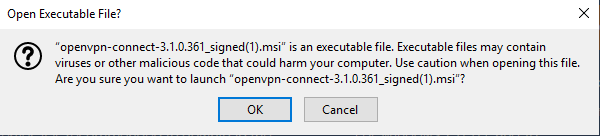
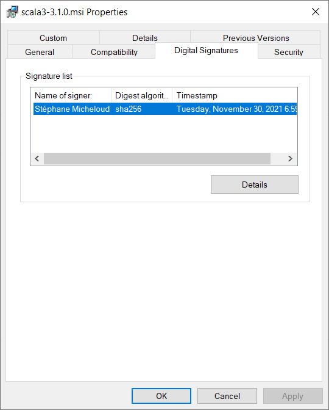
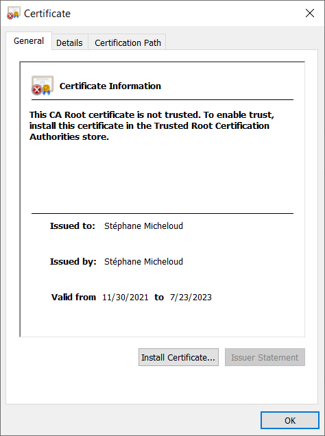

# Security of MSI files <a href="README.md">↩</a>

<table style="font-family:Helvetica,Arial;font-size:14px;line-height:1.6;">
  <tr>
  <td style="border:0;padding:0 10px 0 0;min-width:120px;"></td>
  <td style="border:0;padding:0;vertical-align:text-top;">This document aims to response to the security concerns regarding <code>.msi</code> files (aka. Windows installers). We present several ways to address those concerns, e.g. using file checksums and <a href="https://en.wikipedia.org/wiki/Self-signed_certificate/" rel="external">self-signed certificates</a>.
  </td>
  </tr>
</table>

*WIP* <a href="#footnote_01">1</a>

> **:mag_right:** Further details about the internals of MSI files are available from document [`MSI.md`](./MSI.md).

## File Checksums

We publish our Windows installers (`.msi` files) together with their checksum files (`.md5` and `.sha265` files) on the [Releases](https://github.com/michelou/wix-examples/releases) page of this project.

> **&#9755;** The official [Scala 2 download page](https://www.scala-lang.org/download/scala2.html) ***does not*** provide checksum files for the published [Scala 2][scala2] software distributions (see last section "Other resources"). 

Checksums are used to verify the integrity of files downloaded from an external source, eg. a Windows installer. In this project we wrote two small PowerShell scripts to check the [Scala 2][scala2] and [Scala 3][scala3] Windows installers available on our [Releases](https://github.com/michelou/wix-examples/releases) page.

> **:mag_right:** Concretely each PowerShell script downloads a `.msi` file and its `.md5` (resp. `.sha256`) companion file and checks that the computed checksum is identical with the downloaded checksum.

<pre style="margin:0 4em 0 0;font-size:80%;">
<b>&gt; <a href="https://docs.microsoft.com/en-us/powershell/module/microsoft.powershell.core/about/about_powershell_exe?view=powershell-5.1" rel="external">powershell</a> -nologo -f bin\<a href="bin/scala-checksum.ps1">scala-checksum.ps1</a></b>
Computed: 61A6E578022546ADF0B76A8C09BCD784  scala-2.13.7.msi
MD5 file: 61A6E578022546ADF0B76A8C09BCD784  scala-2.13.7.msi
The two checksums are equal
&nbsp;
<b>&gt; <a href="https://docs.microsoft.com/en-us/powershell/module/microsoft.powershell.core/about/about_powershell_exe?view=powershell-5.1">powershell</a> -nologo -f bin\<a href="bin/scala3-checksum.ps1">scala3-checksum.ps1</a></b>
Computed: F484CD8D12DDA43C88467CDB68FC18C9  scala3-3.1.0.msi
MD5 file: F484CD8D12DDA43C88467CDB68FC18C9  scala3-3.1.0.msi
The two checksums are equal
</pre>

The above PowerShell cmdlets accept several options; for instance for [`scala3-checksum.ps1`](bin/scala3-checksum.ps1) :
- `-version <value>` where `<value>` equals `3.1.0` (*default*) or `3.0.2`.
- `-algorithm <name>` where `<name>` equals `md5` (*default*) or `sha256`
- `-verbose`(displays download command)

<pre style="margin:0 4em 0 0;font-size:80%;">
<b>&gt; <a href="https://docs.microsoft.com/en-us/powershell/module/microsoft.powershell.core/about/about_powershell_exe?view=powershell-5.1">powershell</a> -nologo -f bin\<a href="bin/scala3-checksum.ps1">scala3-checksum.ps1</a> -algorithm sha256</b>
Computed: 484DAD60174CB44D496F8447399577EB5680F599923E3CED9E8D8D89D9254329  scala3-3.1.0.msi
SHA256 file: 484DAD60174CB44D496F8447399577EB5680F599923E3CED9E8D8D89D9254329  scala3-3.1.0.msi
The two checksums are equal
</pre>

> **:mag_right:** See also Chris's post [*What Is a Checksum (and Why Should You Care)?*][resource_hoffman] (September 2019).

## Self-signed Certificates <a href="#footnote_02">2</a>

Command [`signtool`][signtool_cmd] (part of the <a href="https://developer.microsoft.com/en-us/windows/downloads/windows-sdk/">Windows SDK</a>) is the standard tool to sign executable files on MS Windows, i.e. the  Windows installers in our case.

In project [`Scala3Features`](./scala3-examples/Scala3Features/), for instance, we execute [`signtool`][signtool_cmd] to sign the file [`scala3-3.1.0.msi`](https://github.com/michelou/wix-examples/releases/tag/scala3-3.1.0.msi) :

<pre style="font-size:80%;">
<b>&gt; <a href="https://docs.microsoft.com/en-us/windows/win32/seccrypto/signtool">signtool</a> sign /p "&lt;cert_pswd&gt; -v /f "&lt;certs_folder&gt;\wix-examples.pfx" ^
           /d "&lt;description&gt;" ^
           /t "http://timestamp.digicert.com" /fd SHA256 ^
           "Y:\scala3-examples\Scala3Features\target\scala3-3.1.0.msi"</b>
The following certificate was selected:
    Issued to: Stephane Micheloud
    Issued by: Stephane Micheloud
    Expires:   Sun Jul 23 01:02:42 2023
    SHA1 hash: 64C2...

Done Adding Additional Store
Successfully signed: Y:\scala3-examples\Scala3Features\target\scala3-3.1.0.msi

Number of files successfully Signed: 1
Number of warnings: 0
Number of errors: 0
</pre>

Figures **1.1** to **1.2** below show that a digital signature was indeed added to file [`scala3-3.1.0.msi`](https://github.com/michelou/wix-examples/releases/tag/scala3-3.1.0.msi) :

<table>
<tr>
<td>
  
  
<b>Figure 1.1 -</b> MSI File (<i>Propperties</i> window).
  

</td>
<td>
  
  
<b>Figure 1.2 -</b> Signature details (<i>Certificate</i> window).
  

</td>
</tr>
</table>

## Footnotes

[1] ***Security Resources*** [↩](#anchor_01)

- [Security Update Guide - Vulnerabilities][resource_microsoft], by Microsoft, December 2021.
  - [CVE-2021-41379](https://msrc.microsoft.com/update-guide/vulnerability/CVE-2021-41379), November 9, 2021. ([issue resolved](https://docs.microsoft.com/en-us/windows/release-health/resolved-issues-windows-10-21h2#2759msgdesc) on November 22, 2021)
- [6 OpenSSL command options that every sysadmin should know][resource_critelli] by Anthony Critelli, March 2021.
- [Internet Safety: 7 Steps to Keeping Your Computer Safe on the Internet][resource_notenboom] by A. Notenboom, March 2004.

[2] ***Code Signing Resources*** [↩](#anchor_02)

- [Authenticode Code Signing with Microsoft SignTool][resource_digicert] by DigiCert, December 2021.
- [Code-Signing Best Practices][resource_microsoft] by Microsoft, January 2007.

***

*[mics](https://lampwww.epfl.ch/~michelou/)/July 2022* [**&#9650;**](#top)
&nbsp;

<!-- link refs -->

[resource_critelli]: https://www.redhat.com/sysadmin/6-openssl-commands
[resource_digicert]: https://www.digicert.com/kb/code-signing/signcode-signtool-command-line.htm
[resource_hoffman]: https://www.howtogeek.com/363735/what-is-a-checksum-and-why-should-you-care/
[resource_microsoft]: https://docs.microsoft.com/en-us/previous-versions/windows/hardware/design/dn653556(v=vs.85)
[resource_notenboom]: https://askleo.com/internet_safety_7_steps_to_keeping_your_computer_safe_on_the_internet/
[resource_microsoft]: https://msrc.microsoft.com/update-guide/vulnerability
[aaaa]: https://docs.microsoft.com/en-us/powershell/module/pki/new-selfsignedcertificate?view=windowsserver2019-ps
[msiexec_cmd]: https://docs.microsoft.com/en-us/windows-server/administration/windows-commands/msiexec
[scala2]: https://www.scala-lang.org/
[scala3]: https://dotty.epfl.ch
[signtool_cmd]: https://docs.microsoft.com/en-us/windows/win32/seccrypto/signtool
