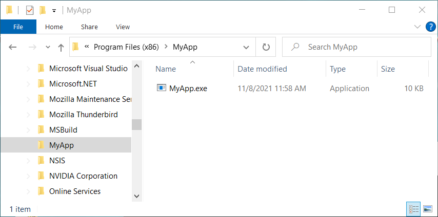
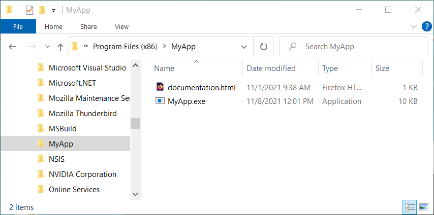
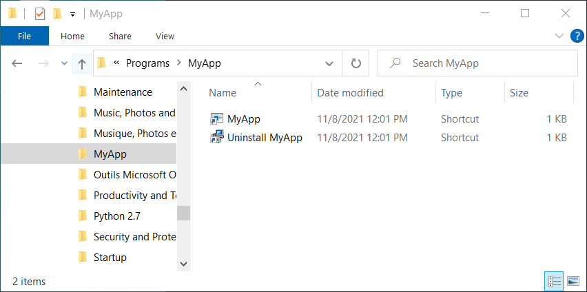
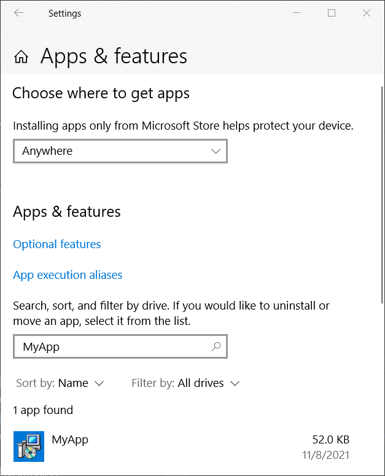
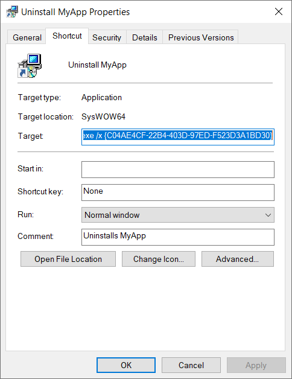
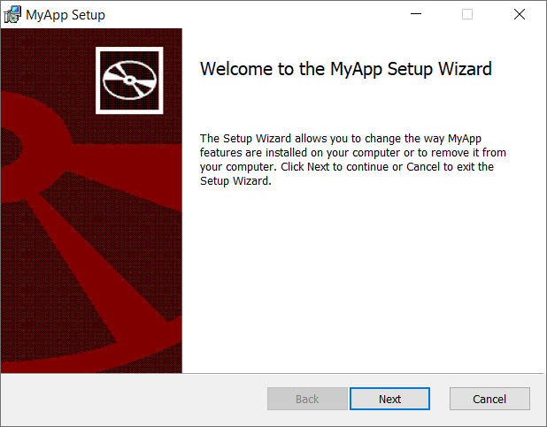
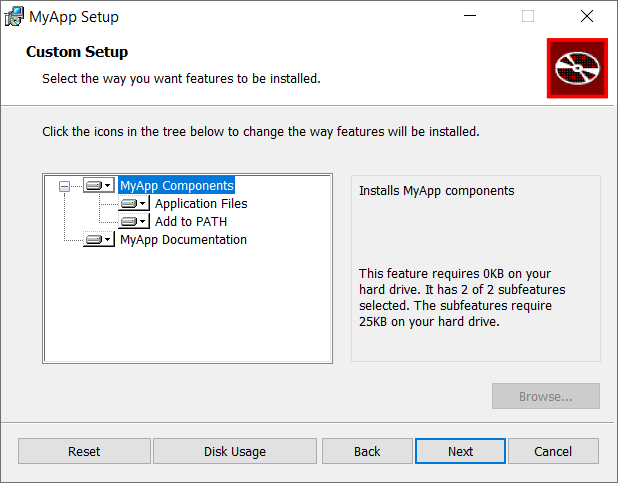
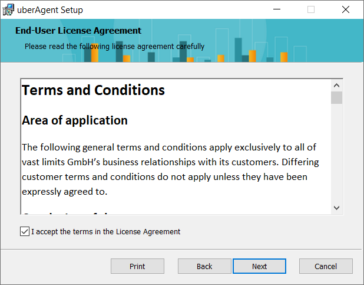
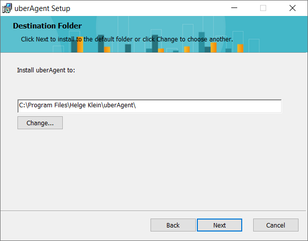
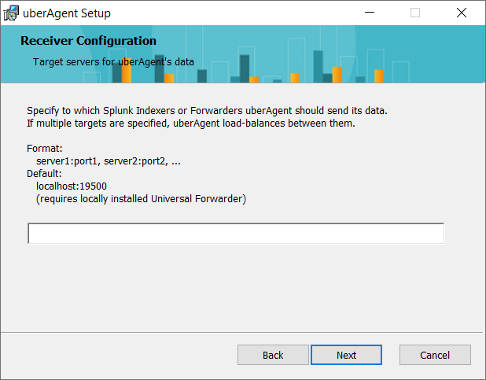

# WiX examples <a href="../README.md">⬆</a>

<table style="font-family:Helvetica,Arial;font-size:14px;line-height:1.6;">
  <tr>
  <td style="border:0;padding:0 10px 0 0;min-width:120px;">
    
  </td>
  <td style="border:0;padding:0;vertical-align:text-top;">
    Directory <strong><code>examples\</code></strong> contains <a href="https://wixtoolset.org/" rel="external">WiX</a> code examples coming from various websites.
  </td>
  </tr>
</table>

The [WiX][wix_toolset] examples presented in the following sections share the same project organization, i.e.
- a directory `app\` with the application files
- a directory `src\` with the [WiX][wix_toolset] source files and resource files
- a batch file `build.bat` to create the Windows installer from the two input directories.

## `MyApp`

In this first example we aim to install a *single file*, concretely the Windows application `MyApp.exe`, accessible for all users and located in the *MyApp* directory inside the [*Program Files*][windows_program_files] system folder.

For that purpose we declare one single [component element][wix_component] in our [WiX][wix_toolset] source file [`MyApp.wxs`](./MyApp/src/MyApp.wxs); the component element belongs to the *MyApp* directory and refers to the above executable.

<pre style="font-size:80%;">
<b>&gt; <a href="https://docs.microsoft.com/en-us/windows-server/administration/windows-commands/cd">cd</a></b>
Y:\examples\MyApp
&nbsp;
<b>&gt; <a href="https://docs.microsoft.com/en-us/windows-server/administration/windows-commands/tree">tree</a> /f . | <a href="https://docs.microsoft.com/en-us/windows-server/administration/windows-commands/findstr">findstr</a> /v /b [a-z]</b>
│   <a href="./MyApp/build.bat">build.bat</a>          <i>(calls candle/light)</i>
│   <a href="./MyApp/build.properties">build.properties</a>   <i>(contains GUID (name,value) pairs)</i>
├───<b>app</b>
│   └───<b>HelloWorld</b>
│       │   <a href="./MyApp/app/HelloWorld/00download.txt">00download.txt</a>
│       │   <a href="./MyApp/app/HelloWorld/build.bat">build.bat</a>  <i>(calls MSBuild)</i>
│       │   <a href="./MyApp/app/HelloWorld/README.md">README.md</a>
│       └───<b>cpp</b>
│           │   <a href="./MyApp/app/HelloWorld/cpp/HelloWorld.sln">HelloWorld.sln</a>
│           │   <a href="./MyApp/app/HelloWorld/cpp/HelloWorld.vcxproj">HelloWorld.vcxproj</a>
│           └───<b>src</b>
│                   <a href="./MyApp/app/HelloWorld/cpp/src/main.cpp">main.cpp</a>
└───<b>src</b>
        <a href="./MyApp/src/MyApp.wxs">MyApp.wxs</a>      <i>(contains GUID names)</i>
</pre>

> **:mag_right:** In order the have a *self-contained* example we include the [`HelloWorld`](./MyApp/HelloWorld/) subproject which contains a simple [Visual Studio solution][vs_solution] for generating `MyApp.exe` to be added to the `MyApp` Windows installer.

Our main batch file [`build.bat`](./MyApp/build.bat) invokes the [WiX][wix_toolset] tools [`candle`][wix_candle] (compiler) and [`light`][wix_light] (linker) with the appropriate settings and inputs.

<pre style="font-size:80%;">
<b>&gt; <a href="./MyApp/build.bat">build</a> -verbose install</b>
Generate executable "MyApp.exe"
Copy executable "MyApp.exe" to directory "Y:\examples\MyApp\app\"
Generate auxiliary WXS file
[...]
Compiling 1 WXS files to directory "target"
Create Windows installer "target\MyApp-1.0.0.msi"
Execute Windows installer "target\MyApp-1.0.0.msi"
</pre>

Figures **1.1** and **1.2** below illustrate the updated user environment after the successful execution of the `MyApp` Windows installer.

> **:mag_right:** The user must navigate to the *Apps &amp; features* window in the *Windows Settings* in order to uninstall the `MyApp` application (**Figure 1.2**).

<table>
<tr>
<td style="text-align:center;">
  
  
<b>Figure 1.1 -</b> <i>MyApp</i> executable (<i>Program Files</i> folder).
</td>
<td style="text-align:center;">
  
  
<b>Figure 1.2 -</b> Uninstall <i>MyApp</i> (<i>Settings</i> window).
</td>
</tr>
</table>

## MyAppShortcuts

This second example adds *Start Menu* shortcuts (see [WiX manual](https://wixtoolset.org/documentation/manual/v3/howtos/files_and_registry/create_start_menu_shortcut.html)) to the above example [`MyApp`](#myapp).

We declare 3 components in our [WiX][wix_toolset] source file [`MyAppShortcuts.wxs`](./MyAppShortcuts/src/MyAppShortcuts.wxs) :
- component 1 refers to the `MyApp` executable (as in previous example).
- component 2 refers to the HTML file [`documentation.html`](./MyAppShortcuts/app/documentation.html).
- component 3 defines the two shortcuts `MyApp` and `Uninstall MyApp` (**Figure 2.2**).

> **:mag_right:** The user has now *two* possibilities to remove the `MyApp` application :
> - from the *Apps &amp; features* window in the [*Windows Settings*][windows_settings]
> - through the *Uninstall MyApp* shortcut in the [*Start Menu*][windows_start_menu] folder.

Figures **2.1** to **2.4** below illustrate the updated user environment after the successful execution of the `MyApp` Windows installer.

<table>
<tr>
<td style="text-align:center;">
  

  
  
<b>Figure 2.1 -</b> <i>MyApp</i> executable (<i>Program Files</i> folder). &nbsp;
  

  

  
  
<b>Figure 2.2 -</b> <i>MyApp</i> shortcuts (<a href="https://support.microsoft.com/en-us/windows/see-what-s-on-the-start-menu-a8ccb400-ad49-962b-d2b1-93f453785a13"><i>Start Menu</i></a> folder).
  

</td>
<td style="text-align:center;">
  
  
<b>Figure 2.3 -</b> Uninstall <i>MyApp</i> (<i>Settings</i> window).
</td>
<td style="text-align:center;">
  
  
<b>Figure 2.4 -</b> Shortcut properties (<i>Uninstall</i> shortcut).
</td>
</tr>
</table>

:mag_right: <b>Figure 2.4</b> shows the window <i>Properties</i> of the *Uninstall* shortcut visible in <b>Figure 2.2</b>; in particular we can read in the field "Target" the GUID value corresponding to `PRODUCT_CODE` in the file [`build.properties`](./MyAppShortcuts/build.properties).

## MyAppLocalized

*tbd*

<pre style="font-size:80%;">
<b>&gt; <a href="https://docs.microsoft.com/en-us/windows-server/administration/windows-commands/cd">cd</a></b>
Y:\examples\MyAppLocalized
&nbsp;
<b>&gt; <a href="https://docs.microsoft.com/en-us/windows-server/administration/windows-commands/tree">tree</a> /f . | <a href="https://docs.microsoft.com/en-us/windows-server/administration/windows-commands/findstr">findstr</a> /v /b [a-z]</b>
│   <a href="./MyAppLocalized/build.bat">build.bat</a>
│   <a href="./MyAppLocalized/build.properties">build.properties</a>
├───<b>app</b>
│   │   <a href="./MyAppLocalized/app/documentation.html">documentation.html</a>
│   └───<b>HelloWorld</b>
│           ... <i>(same as before)</i>
└───<b>src</b>
    │   <a href="./MyAppLocalized/src/Includes.wxi">Includes.wxi</a>
    │   <a href="./MyAppLocalized/src/MyAppLocalized.wxs">MyAppLocalized.wxs</a>
    └───<b>localizations</b>
            <a href="./MyAppLocalized/src/localizations/de-DE.wxl">de-DE.wxl</a>
            <a href="./MyAppLocalized/src/localizations/en-US.xwl">en-US.wxl</a>
            <a href="./MyAppLocalized/src/localizations/fr-FR.wxl">fr-FR.wxl</a>
            <a href="./MyAppLocalized/src/localizations/README.txt">README.txt</a>
</pre>

The batch subcommand `link`generates one localized Windows installer for every localization file found in the directory `src\localizations\`.

<pre style="font-size:80%;">
<b>&gt; <a href="./MyAppLocalized/build.bat">build</a> clean link &amp;&amp; <a href="https://docs.microsoft.com/en-us/windows-server/administration/windows-commands/dir">dir</a> /a-d /b target</b>
candle_opts.txt
candle_sources.txt
light_opts.txt
MyApp-1.0.0-de-DE.msi
MyApp-1.0.0-de-DE.wixpdb
MyApp-1.0.0-fr-FR.msi
MyApp-1.0.0-fr-FR.wixpdb
MyApp-1.0.0.msi
MyApp-1.0.0.wixpdb
MyAppLocalized.wixobj
</pre>

## MyAppFeatures

*tbd*

<table>
<tr>
<td style="text-align:center;">
  
  
<b>Figure 4.1 -</b> Welcome (<i>MyApp</i> installer).
</td>
<td style="text-align:center;">
  
  
<b>Figure 4.2 -</b> Custom Setup (<i>MyApp</i> installer).
</td>
</tr>
</table>

## uberAgent

Example `uberAgent` is adapted from Helge Klein's blog entry [Real-World Example: WiX/MSI Application Installer][uberAgent] (February 2021).

The project directory is organized in the same way as the previous [WiX][wix_toolset] examples :

<pre style="font-size:80%;">
<b>&gt; <a href="https://docs.microsoft.com/en-us/windows-server/administration/windows-commands/cd">cd</a></b>
Y:\examples\uberAgent
&nbsp;
<b>&gt; <a href="https://docs.microsoft.com/en-us/windows-server/administration/windows-commands/tree">tree</a> /f . | <a href="https://docs.microsoft.com/en-us/windows-server/administration/windows-commands/findstr">findstr</a> /v /b [a-z]</b>
│   <a href="./uberAgent/00download.txt">00download.txt</a>
│   <a href="./uberAgent/build.bat">build.bat</a>
│   <a href="./uberAgent/build.properties">build.properties</a>
├───<b>app</b>
│       Eula-en.rtf
│       <a href="./uberAgent/app/uberAgent.conf">uberAgent.conf</a>
│       <a href="./uberAgent/app/uberAgent.conf.txt">uberAgent.conf.txt</a>
│       uberAgent.exe
└───<b>src</b>
    │   <a href="./uberAgent/src/LicenseAgreementDlg_HK.wxs">LicenseAgreementDlg_HK.wxs</a>
    │   <a href="./uberAgent/src/Product.wxs">Product.wxs</a>
    │   <a href="./uberAgent/src/Product_en-us.wxl">Product_en-us.wxl</a>
    │   <a href="./uberAgent/src/ServerDlg.wxs">ServerDlg.wxs</a>
    │   <a href="./uberAgent/src/WixUI_HK.wxs">WixUI_HK.wxs</a>
    └───<b>images</b>
            app.ico
            <a href="./uberAgent/src/images/app.png">app.png</a>
            <a href="./uberAgent/src/images/app.png.txt">app.png.txt</a>
            <a href="./uberAgent/src/images/BannerTop.bmp">BannerTop.bmp</a>
            <a href="./uberAgent/src/images/Dialog.bmp">Dialog.bmp</a>
            <a href="./uberAgent/src/images/Dialog.bmp.txt">Dialog.bmp.txt</a>
</pre>

Figures **3.1** to **3.4** below illustrate the localized graphical user interface of the generated Windows installers.

<table>
<tr>
<td style="text-align:center;">
  

  
  
<b>Figure 3.1 -</b> Welcome (<i>uberAgent</i> installer). &nbsp;
  

  

  
  
<b>Figure 3.2 -</b> EULA <i>(uberAgent</i> installer).
  

</td>
<td style="text-align:center;">
  

  
  
<b>Figure 3.3 -</b> Destination Folder (<i>uberAgent</i> installer). &nbsp;
  

  

  
  
<b>Figure 3.4 -</b> Receiver Configuration <i>(uberAgent</i> installer).
  

</td>
</tr>
</table>

## Footnotes

<b name="footnote_01">[1]</b> ***GUID*** [↩](#anchor_01)

A GUID is a 128-bit integer (16 bytes) that can be used across all computers and networks wherever a unique identifier is required. Such an identifier has a very low probability of being duplicated (<i>see also</i> the nice article series from <a href="https://ericlippert.com/about-eric-lippert/">Eric Lippert</a>'s <i>"Guid guide"</i>, <a href="https://ericlippert.com/2012/04/24/guid-guide-part-one/">part 1</a>, <a href="https://ericlippert.com/2012/04/30/guid-guide-part-two/">part 2</a> and <a href="https://ericlippert.com/2012/05/07/guid-guide-part-three/">part 3</a>).

<a href="https://wixtoolset.org/">WiX</a> examples developed in this project rely on the PowerShell cmdlet <a href="https://docs.microsoft.com/en-us/powershell/module/microsoft.powershell.utility/new-guid?view=powershell-7.2#examples"><code>New-Guid</code></a> to generate GUID values; for instance :

<pre style="margin:0 0 1em 20px;font-size:80%;">
<b>&gt; powershell -C <a href="https://docs.microsoft.com/en-us/powershell/module/microsoft.powershell.utility/new-guid?view=powershell-7.2#examples">"(New-Guid).Guid"</a></b>
2d30a843-3eb2-497a-99a1-49a368bba5f7
</pre>

***

*[mics](https://lampwww.epfl.ch/~michelou/)/November 2021* [**&#9650;**](#top)
&nbsp;

<!-- link refs -->

[uberAgent]: https://helgeklein.com/blog/real-world-example-wix-msi-application-installer/
[vs_solution]: https://docs.microsoft.com/en-us/visualstudio/extensibility/internals/solution-dot-sln-file?view=vs-2022
[windows_program_files]: https://en.wikipedia.org/wiki/Program_Files
[windows_settings]: https://support.microsoft.com/en-us/windows/find-settings-in-windows-10-6ffbef87-e633-45ac-a1e8-b7a834578ac6
[windows_start_menu]: https://support.microsoft.com/en-us/windows/see-what-s-on-the-start-menu-a8ccb400-ad49-962b-d2b1-93f453785a13
[wix_candle]: https://wixtoolset.org/documentation/manual/v3/overview/candle.html
[wix_component]: https://wixtoolset.org/documentation/manual/v3/xsd/wix/component.html
[wix_light]: https://wixtoolset.org/documentation/manual/v3/overview/light.html
[wix_toolset]: https://wixtoolset.org/
