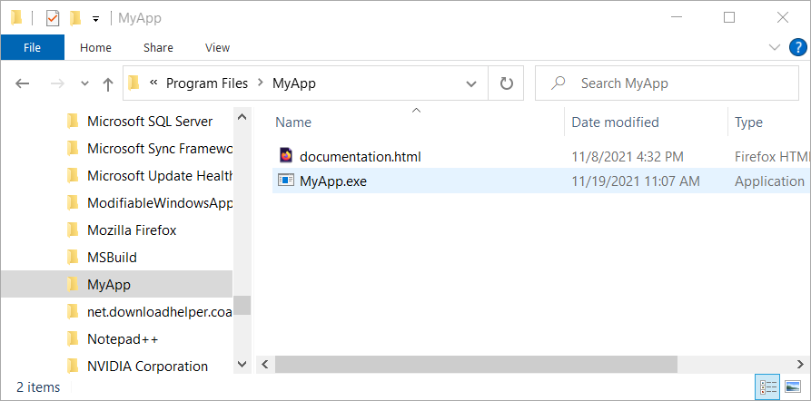
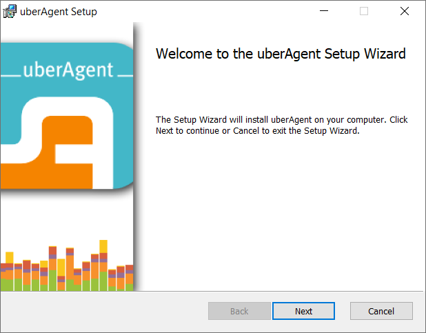

# WiX code examples <a href="../README.md">⬆</a>

<table style="font-family:Helvetica,Arial;font-size:14px;line-height:1.6;">
  <tr>
  <td style="border:0;padding:0 10px 0 0;min-width:120px;">
    
  </td>
  <td style="border:0;padding:0;vertical-align:text-top;">
    Directory <strong><code>examples\</code></strong> contains <a href="https://wixtoolset.org/" rel="external">WiX</a> code examples coming from various websites.
  </td>
  </tr>
</table>

The [WiX][wix_toolset] projects presented in the following sections have several characteristics in common, i.e.
1) each project includes
   - an `app\` directory with the application files
   - a `src\` directory with the [WiX][wix_toolset] source files and resource files
   - a batch file `build.bat` to create the Windows installer from the two input directories.
2) each WiX source file contains just GUID <a href="#footnote_01">1</a> names instead of GUID values; GUID values are externalized into the configuration file `build.properties`. The substitution is performed before the [WiX][wix_toolset] tools are executed. For instance:

<table style="font-size:80%;width:70%;border:solid lightgray 2px;margin:0 0 0 40px;">
<tr>
<td>

<code>src\MyApp.wxs</code> 
&nbsp;&nbsp;&nbsp;&nbsp;<code>&lt;product&nbsp;id="YOURGUID-PRODUCT_CODE"&gt;</code>

<b>+</b>

<code>build.properties</code> 
&nbsp;&nbsp;&nbsp;&nbsp;<code>PRODUCT_CODE=80dd48f1-ea75-4a81-bd56-a06f600fdc99</code>

<b>⇩</b>

<code>target\src_gen\MyApp.wxs</code> 
&nbsp;&nbsp;&nbsp;&nbsp;<code>&lt;product&nbsp;id="80dd48f1-ea75-4a81-bd56-a06f600fdc99"&gt;</code>

</td>
</tr>
</table>

## `MyApp`

In this first example we aim to install a *single file*, concretely the Windows executable `MyApp.exe`, accessible for all users and located in the *MyApp* directory inside the [*Program Files*][windows_program_files] system folder.

For that purpose we declare one single [component element][wix_component] in our WiX source file [`MyApp.wxs`](./MyApp/src/MyApp.wxs); the component element belongs to the *MyApp* directory and refers to the above executable.

<pre style="font-size:80%;">
<b>&gt; <a href="https://docs.microsoft.com/en-us/windows-server/administration/windows-commands/cd">cd</a></b>
Y:\examples\MyApp
&nbsp;
<b>&gt; <a href="https://docs.microsoft.com/en-us/windows-server/administration/windows-commands/tree">tree</a> /f . | <a href="https://docs.microsoft.com/en-us/windows-server/administration/windows-commands/findstr">findstr</a> /v /b [a-z]</b>
│   <a href="./MyApp/build.bat">build.bat</a>
│   <a href="./MyApp/build.properties">build.properties</a>
├───<b>app</b>
│   └───HelloWorld
│       │   <a href="./MyApp/app/HelloWorld/00download.txt">00download.txt</a>
│       │   <a href="./MyApp/app/HelloWorld/build.bat">build.bat</a>
│       │   <a href="./MyApp/app/HelloWorld/README.md">README.md</a>
│       └───<b>cpp</b>
│           │   <a href="./MyApp/app/HelloWorld/cpp/HelloWorld.sln">HelloWorld.sln</a>
│           │   <a href="./MyApp/app/HelloWorld/cpp/HelloWorld.vcxproj">HelloWorld.vcxproj</a>
│           └───<b>src</b>
│                   <a href="./MyApp/app/HelloWorld/cpp/src/main.cpp">main.cpp</a>
└───<b>src</b>
        <a href="./MyApp/src/MyApp.wxs">MyApp.wxs</a>
</pre>

> **:mag_right:** In order the have a *self-contained* example we include the [`HelloWorld`](./MyApp/HelloWorld/) subproject which contains a simple Visual Studio solution for generating the `MyApp.exe` executable to be later added to our Windows installer.

Our main batch file [`build.bat`](./MyApp/build.bat) invokes the [WiX][wix_toolset] tools [`candle`][wix_candle] (compiler) and [`light`][wix_light] (linker) with the appropriate settings and inputs.

<pre style="font-size:80%;">
<b>&gt; <a href="./MyApp/build.bat">build</a> -verbose install</b>
Generate executable "MyApp.exe"
Copy executable "MyApp.exe" to directory "Y:\examples\MyApp\app\"
Generate auxiliary WXS file
[...]
Compiling 1 WXS files to directory "target"
Create Windows installer "target\MyApp.msi"
Execute Windows installer "target\MyApp.msi"
</pre>

Figures **1.1** and **1.2** below illustrate the updated user environment after the successful execution of the Windows installer.

> **:mag_right:** The user must navigate to the *Apps &amp; features* window in the *Windows Settings* in order to uninstall the `MyApp` application (**Figure 1.2**).

<table>
<tr>
<td style="text-align:center;">
  
  
<b>Figure 1.1 -</b> <i>MyApp</i> executable (<i>Program Files (x86)</i> folder).
</td>
<td style="text-align:center;">
  
  
<b>Figure 1.2 -</b> Uninstalling <i>MyApp</i> (<i>Settings</i> window).
</td>
</tr>
</table>

## MyAppShortcuts

This second example adds *Start Menu* shortcuts (see [WiX manual](https://wixtoolset.org/documentation/manual/v3/howtos/files_and_registry/create_start_menu_shortcut.html)) to the above example [`MyApp`](#myapp).

We declare 3 components in our [WiX][wix_toolset] source file [`MyAppShortcuts.wxs`](./MyAppShortcuts/src/MyAppShortcuts.wxs) :
- component 1 refers to the `MyApp` executable (as in previous example).
- component 2 refers to the HTML file [`documentation.html`](./MyAppShortcuts/app/documentation.html).
- component 3 defines the two shortcuts `MyApp` and `Uninstall MyApp` (**Figure 2.2**).

> **:mag_right:** The user has now *two* possibilities to remove the `MyApp` application :
> - from the *Apps &amp; features* window in the [*Windows Settings*][windows_settings]
> - through the *Uninstall MyApp* shortcut in the [*Start Menu*][windows_start_menu] folder.

Figures **2.1** to **2.3** below illustrate the updated user environment after the successful execution of the Windows installer.

<table>
<tr>
<td style="text-align:center;">
  

  
  
<b>Figure 2.1 -</b> <i>MyApp</i> executable (<i>Program Files (x86)</i> folder). &nbsp;
  

  

  
  
<b>Figure 2.2 -</b> <i>MyApp</i> shortcuts (<a href="https://support.microsoft.com/en-us/windows/see-what-s-on-the-start-menu-a8ccb400-ad49-962b-d2b1-93f453785a13"><i>Start Menu</i></a> folder).
  

</td>
<td style="text-align:center;">
  
  
<b>Figure 2.3 -</b> Uninstalling <i>MyApp</i> (<i>Settings</i> window).
</td>
</tr>
</table>

## MyAppLocalized

*tbd*

## MyAppFeatures

*tbd*

## uberAgent

Example `uberAgent` is adapted from Helge Klein's blog entry [Real-World Example: WiX/MSI Application Installer][uberAgent].

The directory organization is similar to the previous [WiX][wix_toolset] examples :

<pre style="font-size:80%;">
<b>&gt; <a href="https://docs.microsoft.com/en-us/windows-server/administration/windows-commands/cd">cd</a></b>
Y:\examples\uberAgent
&nbsp;
<b>&gt; <a href="https://docs.microsoft.com/en-us/windows-server/administration/windows-commands/tree">tree</a> /f . | <a href="https://docs.microsoft.com/en-us/windows-server/administration/windows-commands/findstr">findstr</a> /v /b [a-z]</b>
│   <a href="./uberAgent/00download.txt">00download.txt</a>
│   <a href="./uberAgent/build.bat">build.bat</a>
│   <a href="./uberAgent/build.properties">build.properties</a>
├───<b>app</b>
│       Eula-en.rtf
│       <a href="./uberAgent/app/uberAgent.conf">uberAgent.conf</a>
│       <a href="./uberAgent/app/uberAgent.conf.txt">uberAgent.conf.txt</a>
│       uberAgent.exe
└───<b>src</b>
    │   <a href="./uberAgent/src/LicenseAgreementDlg_HK.wxs">LicenseAgreementDlg_HK.wxs</a>
    │   <a href="./uberAgent/src/Product.wxs">Product.wxs</a>
    │   <a href="./uberAgent/src/Product_en-us.wxl">Product_en-us.wxl</a>
    │   <a href="./uberAgent/src/ServerDlg.wxs">ServerDlg.wxs</a>
    │   <a href="./uberAgent/src/WixUI_HK.wxs">WixUI_HK.wxs</a>
    └───<b>images</b>
            app.ico
            <a href="./uberAgent/src/images/app.png">app.png</a>
            <a href="./uberAgent/src/images/app.png.txt">app.png.txt</a>
            <a href="./uberAgent/src/images/BannerTop.bmp">BannerTop.bmp</a>
            <a href="./uberAgent/src/images/Dialog.bmp">Dialog.bmp</a>
            <a href="./uberAgent/src/images/Dialog.bmp.txt">Dialog.bmp.txt</a>
</pre>

Figures **3.1** to **3.4** below illustrate the localized graphical user interface of the generated Windows installers.

<table>
<tr>
<td style="text-align:center;">
  

  
  
<b>Figure 3.1 -</b> Welcome (<i>uberAgent</i> Windows installer). &nbsp;
  

  

  
  
<b>Figure 3.2 -</b> EULA <i>(uberAgent</i> Windows installer).
  

</td>
<td style="text-align:center;">
  

  
  
<b>Figure 3.3 -</b> Destination Folder (<i>uberAgent</i> Windows installer). &nbsp;
  

  

  
  
<b>Figure 3.4 -</b> Receiver Configuration <i>(uberAgent</i> Windows installer).
  

</td>
</tr>
</table>

## Footnotes

<b name="footnote_01">[1]</b> ***GUID*** [↩](#anchor_01)

A GUID is a 128-bit integer (16 bytes) that can be used across all computers and networks wherever a unique identifier is required. Such an identifier has a very low probability of being duplicated.

***

*[mics](https://lampwww.epfl.ch/~michelou/)/November 2021* [**&#9650;**](#top)
&nbsp;

<!-- link refs -->

[firegiant]: https://www.firegiant.com/
[microsoft_powershell]: https://docs.microsoft.com/en-us/powershell/scripting/getting-started/getting-started-with-windows-powershell?view=powershell-6
[scala3_releases]: https://github.com/lampepfl/dotty/releases
[uberAgent]: https://helgeklein.com/blog/real-world-example-wix-msi-application-installer/
[windows_program_files]: https://en.wikipedia.org/wiki/Program_Files
[windows_settings]: https://support.microsoft.com/en-us/windows/find-settings-in-windows-10-6ffbef87-e633-45ac-a1e8-b7a834578ac6
[windows_start_menu]: https://support.microsoft.com/en-us/windows/see-what-s-on-the-start-menu-a8ccb400-ad49-962b-d2b1-93f453785a13
[wix_candle]: https://wixtoolset.org/documentation/manual/v3/overview/candle.html
[wix_component]: https://wixtoolset.org/documentation/manual/v3/xsd/wix/component.html
[wix_light]: https://wixtoolset.org/documentation/manual/v3/overview/light.html
[wix_toolset]: https://wixtoolset.org/
