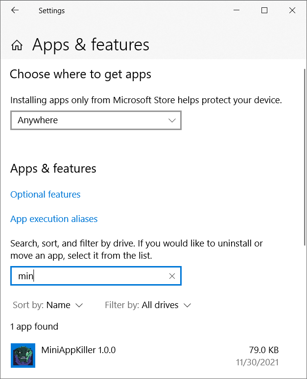

# WiX examples <a href="../README.md">⬆</a>

<table style="font-family:Helvetica,Arial;font-size:14px;line-height:1.6;">
  <tr>
  <td style="border:0;padding:0 10px 0 0;min-width:120px;">
    
  </td>
  <td style="border:0;padding:0;vertical-align:text-top;">
    Directory <strong><code>examples\</code></strong> contains <a href="https://wixtoolset.org/" rel="external">WiX</a> examples coming from various websites.
  </td>
  </tr>
</table>

The [WiX][wix_toolset] examples presented in the following sections 
- *share* the same project organisation as the [WiX][wix_toolset] examples from page [myexamples/README.md](../myexamples/README.md).
- *differ* in several respects from the [WiX][wix_toolset] examples from page [myexamples/README.md](../myexamples/README.md), in particular :
   - we slightly modified the main [WiX][wix_toolset] source file to match our project settings.
   - we recreated most resource files (eg. images) not made available by the original author (eg. project [*uberAgent*](#uber_agent)).

## MiniAppKiller

Project `MinAppKiller` is adapted from Heiswayi Nrird's blog post *[What is WiX Toolset & how to use it][MiniAppKiller]* (May 2018).

The project directory is organized in the same way as the previous [WiX][wix_toolset] examples :

<pre style="font-size:80%;">
<b>&gt; <a href="https://docs.microsoft.com/en-us/windows-server/administration/windows-commands/cd">cd</a></b>
Y:\examples\MiniAppKiller
&nbsp;
<b>&gt; <a href="https://docs.microsoft.com/en-us/windows-server/administration/windows-commands/tree">tree</a> /f . | <a href="https://docs.microsoft.com/en-us/windows-server/administration/windows-commands/findstr">findstr</a> /v /b [a-z]</b>
│   <a href="./MiniAppKiller/00download.txt">00download.txt</a>
│   <a href="./MiniAppKiller/build.bat">build.bat</a>
├───<b>app</b>
│       <a href="./MiniAppKiller/app/config.ini">config.ini</a>
│       EULA-en.rtf
│       EULA-fr.rtf
│       filters.txt
│       MiniAppKiller.exe   <i>(copy of %WINDIR%\system32\calc.exe)</i>
└───<b>src</b>
    │   <a href="./MiniAppKiller/src/Product.Var.wxi">Product.Var.wxi</a>
    │   <a href="./MiniAppKiller/src/Product.wxs">Product.wxs</a>
    ├───<b>images</b>
    │       <a href="./MiniAppKiller/src/images/app.ico">app.ico</a>
    │       app.ico.txt
    │       <a href="./MiniAppKiller/src/images/Dialog.bmp">Dialog.bmp</a>
    │       Dialog.bmp.txt
    │       <a href="./MiniAppKiller/src/images/TopBanner.bmp">TopBanner.bmp</a>
    │       <a href="./MiniAppKiller/src/images/TopBanner.bmp.txt">TopBanner.bmp.txt</a>
    └───<b>localizations</b>
            <a href="./MiniAppKiller/src/localizations/Product.Loc_en-US.wxl">Product.Loc_en-US.wxl</a>
            <a href="./MiniAppKiller/src/localizations/Product.Loc_fr-FR.wxl">Product.Loc_fr-FR.wxl</a>
</pre>

Figures **1.1** to **1.4** below illustrate the localized graphical user interface of the generated *MiniAppKiller* Windows installer while figures **1.5** and **1.6** show the updated user environment.

<table>
<tr>
<td style="text-align:center;">
  
  
<b>Figure 1.1 -</b> Welcome (<i>MiniAppKiller</i> installer). &nbsp;
  

  

  
  
<b>Figure 1.2 -</b> EULA <i>(MiniAppKiller</i> installer).
  

</td>
<td style="text-align:center;">
  
  
<b>Figure 1.3 -</b> Destination Folder (<i>MiniAppKiller</i> installer). &nbsp;
  

  

  
  
<b>Figure 1.4 -</b> Completed installation <i>(MiniAppKiller</i> installer).
  

</td>
<td style="text-align:center;">
  
  
<b>Figure 1.5 -</b> <i>MiniAppKiller</i> application (<i>Program Files</i> folder). &nbsp;
  

  

  
  
<b>Figure 1.6 -</b> Uninstall <i>MiniAppKiller</i> <i>(Settings</i> folder).
  

</td>
</tr>
</table>

## uberAgent

Project `uberAgent` is adapted from Helge Klein's blog post *[Real-World Example: WiX/MSI Application Installer][uberAgent]* (February 2021).

The project directory is organized in the same way as the previous [WiX][wix_toolset] examples :

<pre style="font-size:80%;">
<b>&gt; <a href="https://docs.microsoft.com/en-us/windows-server/administration/windows-commands/cd">cd</a></b>
Y:\examples\uberAgent
&nbsp;
<b>&gt; <a href="https://docs.microsoft.com/en-us/windows-server/administration/windows-commands/tree">tree</a> /f . | <a href="https://docs.microsoft.com/en-us/windows-server/administration/windows-commands/findstr">findstr</a> /v /b [a-z]</b>
│   <a href="./uberAgent/00download.txt">00download.txt</a>
│   <a href="./uberAgent/build.bat">build.bat</a>
│   <a href="./uberAgent/build.properties">build.properties</a>
├───<b>app</b>
│       Eula-en.rtf
│       <a href="./uberAgent/app/uberAgent.conf">uberAgent.conf</a>
│       <a href="./uberAgent/app/uberAgent.conf.txt">uberAgent.conf.txt</a>
│       uberAgent.exe
└───<b>src</b>
    │   <a href="./uberAgent/src/LicenseAgreementDlg_HK.wxs">LicenseAgreementDlg_HK.wxs</a>
    │   <a href="./uberAgent/src/Product.wxs">Product.wxs</a>
    │   <a href="./uberAgent/src/Product_en-us.wxl">Product_en-us.wxl</a>
    │   <a href="./uberAgent/src/ServerDlg.wxs">ServerDlg.wxs</a>
    │   <a href="./uberAgent/src/WixUI_HK.wxs">WixUI_HK.wxs</a>
    └───<b>images</b>
            app.ico
            <a href="./uberAgent/src/images/app.png">app.png</a>
            <a href="./uberAgent/src/images/app.png.txt">app.png.txt</a>
            <a href="./uberAgent/src/images/BannerTop.bmp">BannerTop.bmp</a>
            <a href="./uberAgent/src/images/Dialog.bmp">Dialog.bmp</a>
            <a href="./uberAgent/src/images/Dialog.bmp.txt">Dialog.bmp.txt</a>
</pre>

Figures **2.1** to **2.4** below illustrate the localized graphical user interface of the generated *uberAgent* Windows installer.

<table>
<tr>
<td style="text-align:center;">
  

  
  
<b>Figure 2.1 -</b> Welcome (<i>uberAgent</i> installer). &nbsp;
  

  

  
  
<b>Figure 2.2 -</b> EULA <i>(uberAgent</i> installer).
  

</td>
<td style="text-align:center;">
  

  
  
<b>Figure 2.3 -</b> Destination Folder (<i>uberAgent</i> installer). &nbsp;
  

  

  
  
<b>Figure 2.4 -</b> Receiver Configuration <i>(uberAgent</i> installer).
  

</td>
</tr>
</table>

<!--
## Footnotes

<b name="footnote_01">[1]</b> ***File Checksums*** [↩](#anchor_01)

-->

***

*[mics](https://lampwww.epfl.ch/~michelou/)/November 2021* [**&#9650;**](#top)
&nbsp;

<!-- link refs -->

[MiniAppKiller]: https://heiswayi.nrird.com/get-started-with-wix-toolset
[uberAgent]: https://helgeklein.com/blog/real-world-example-wix-msi-application-installer/
[vs_solution]: https://docs.microsoft.com/en-us/visualstudio/extensibility/internals/solution-dot-sln-file?view=vs-2022
[windows_program_files]: https://en.wikipedia.org/wiki/Program_Files
[windows_settings]: https://support.microsoft.com/en-us/windows/find-settings-in-windows-10-6ffbef87-e633-45ac-a1e8-b7a834578ac6
[windows_start_menu]: https://support.microsoft.com/en-us/windows/see-what-s-on-the-start-menu-a8ccb400-ad49-962b-d2b1-93f453785a13
[wix_candle]: https://wixtoolset.org/documentation/manual/v3/overview/candle.html
[wix_component]: https://wixtoolset.org/documentation/manual/v3/xsd/wix/component.html
[wix_light]: https://wixtoolset.org/documentation/manual/v3/overview/light.html
[wix_toolset]: https://wixtoolset.org/
