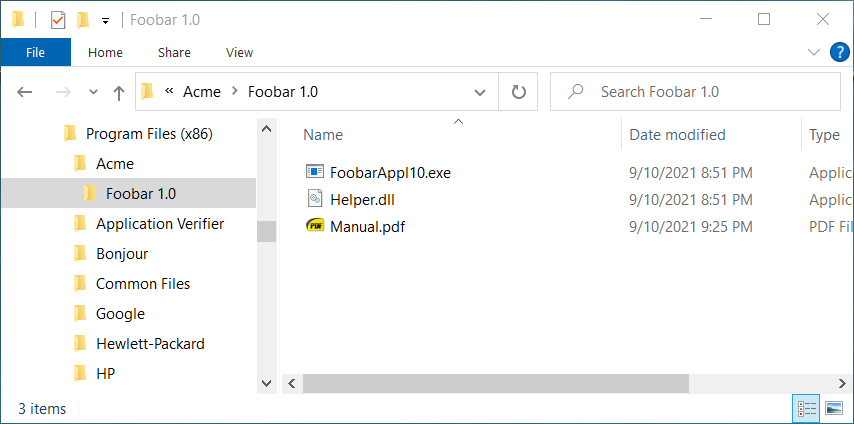
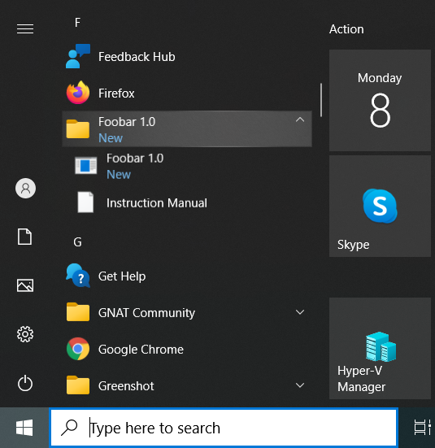
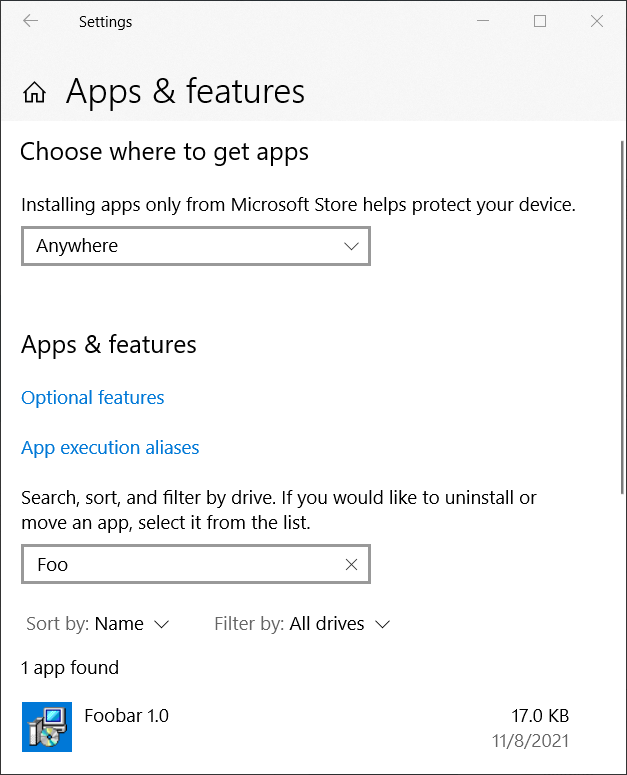

# Firegiant's WiX examples <a href="../README.md">⬆</a>

<table style="font-family:Helvetica,Arial;line-height:1.6;">
  <tr>
  <td style="border:0;padding:0 10px 0 0;min-width:120px;">
    
  </td>
  <td style="border:0;padding:0;vertical-align:text-top;">
    Directory <strong><code>firegiant-examples\</code></strong> contains the <a href="https://wixtoolset.org/" rel="external">WiX Toolset</a> examples presented in the Firegiant's online <a href="https://www.firegiant.com/wix/tutorial/" rel="external">WiX Toolset Tutorial</a>, the authoritative guide for <a href="https://wixtoolset.org/" rel="external">WiX</a> developers.
  </td>
  </tr>
</table>

The [WiX][wix_toolset] examples presented in the following sections are adapted<a href="#footnote_01">1</a> from the onlie [WiX Toolset Tutorial](https://www.firegiant.com/wix/tutorial/) and are organized in the same way as our [WiX][wix_toolset] examples from page [`myexamples/README.md`](../myexamples/README.md).

1. [Getting Started](https://www.firegiant.com/wix/tutorial/getting-started/)
   - [Put it to Use](https://www.firegiant.com/wix/tutorial/getting-started/putting-it-to-use/) : [`SampleFirst.zip`](https://www.firegiant.com/system/files/samples/SampleFirst.zip).
   - [Conditional Installation](https://www.firegiant.com/wix/tutorial/getting-started/conditional-installation/) : [`SampleCondition.zip`](https://www.firegiant.com/system/files/samples/SampleCondition.zip).
2. [User Interface](https://www.firegiant.com/wix/tutorial/user-interface/)
   - [First Steps](https://www.firegiant.com/wix/tutorial/user-interface/first-steps/) : [`SampleWixUI.zip`](https://www.firegiant.com/system/files/samples/SampleWixUI.zip)
   - [New Link in the Chain](https://www.firegiant.com/wix/tutorial/user-interface/new-link-in-the-chain/) : [`SampleWixUIAddDlg.zip`](https://www.firegiant.com/system/files/samples/SampleWixUIAddDlg.zip)
   - [Think Localized](https://www.firegiant.com/wix/tutorial/user-interface/think-localized/) : [`SampleWixUIAddDlgLoc.zip`](https://www.firegiant.com/system/files/samples/SampleWixUIAddDlgLoc.zip)
3. [Events and Actions](https://www.firegiant.com/wix/tutorial/events-and-actions/)
     - [How to Manage?](https://www.firegiant.com/wix/tutorial/events-and-actions/how-to-manage/) : [`SampleAskKeyNET.zip`](https://www.firegiant.com/system/files/samples/SampleAskKeyNET.zip)
4. [Upgrades and Modularizations](https://www.firegiant.com/wix/tutorial/upgrades-and-modularization/)
     - [Checking for Oldies](https://www.firegiant.com/wix/tutorial/upgrades-and-modularization/checking-for-oldies/) : [`SampleUpgrade.zip`](https://www.firegiant.com/system/files/samples/SampleUpgrade.zip)
     - [Patchwork](https://www.firegiant.com/wix/tutorial/upgrades-and-modularization/patchwork/) : [`SamplePatch.zip`](https://www.firegiant.com/system/files/samples/SamplePatch.zip)
    - [Fragments](https://www.firegiant.com/wix/tutorial/upgrades-and-modularization/fragments/) : [`SampleFragment.zip`](https://www.firegiant.com/system/files/samples/SampleFragment.zip)
    - [Mergers](https://www.firegiant.com/wix/tutorial/upgrades-and-modularization/mergers/) : [`SampleMergeModule.zip`](https://www.firegiant.com/system/files/samples/SampleMergeModule.zip)
5. [User Interface Revisited](https://www.firegiant.com/wix/tutorial/user-interface-revisited/)
    - [A Single Dialog](https://www.firegiant.com/wix/tutorial/user-interface-revisited/a-single-dialog/) : [`SampleCustomUI.zip`](https://www.firegiant.com/system/files/samples/SampleCustomUI.zip)

## `SampleFirst` Example

In this first example the [WiX][wix_toolset] source file [`SampleFirst.wxs`](./SampleFirst/src/SampleFirst.wxs) declares 4 `component` elements for the 3 application files and one menu shortcut.

The project is organized as follows :
<pre style="font-size:80%;">
<b>&gt; <a href="https://docs.microsoft.com/en-us/windows-server/administration/windows-commands/cd">cd</a></b>
Y:\firegiant-examples\SampleFirst
&nbsp;
<b>&gt; <a href="https://docs.microsoft.com/en-us/windows-server/administration/windows-commands/tree">tree</a> /f . | <a href="https://docs.microsoft.com/en-us/windows-server/administration/windows-commands/findstr">findstr</a> /v /b [a-z]</b>
│   <a href="./SampleFirst/build.bat">build.bat</a>
├───<a href="./SampleFirst/app/"><b>app</b></a>
│       FoobarAppl10.exe
│       Helper.dll
│       Manual.pdf
└───<a href="./SampleFirst/src/"><b>src</b></a>
        <a href="./SampleFirst/src/SampleFirst.wxs">SampleFirst.wxs</a>
</pre>

> **:mag_right:** Command [`build help`](./SampleFirst/build.bat) displays the batch file options and subcommands.

Command [`build pack`](./SampleFirst/build.bat) generates the MSI package file:

<pre style="font-size:80%;">
<b>&gt; <a href="./SampleFirst/build.bat">build</a> clean pack &amp;&amp; <a href="https://docs.microsoft.com/en-us/windows-server/administration/windows-commands/tree">tree</a> /f target | <a href="https://docs.microsoft.com/en-us/windows-server/administration/windows-commands/findstr">findstr</a> /v /b [a-z]</b>
│   candle_ops.txt
│   candle_sources.txt
│   light_opts.txt
│   Sample.cab
│   SampleFirst.msi
│   SampleFirst.wixobj
│   SampleFirst.wixpdb
└───<b>src_gen</b>
        SampleFirst.wxs
</pre>

> **:mag_right:** In the above listing of the `target\` directory file `target\src_gen\SampleFirst.wxs` contains the real [GUID](http://guid.one/guid)s instead of the symbol names defined in file [`src\SampleFirst.wxs`](./SampleFirst/src/SampleFirst.wxs).

Figures **1.1** to **1.3** below illustrate the updated user environment after the successful execution of the *SampleFirst* Windows installer.

<table>
<tr>
<td style="text-align:center;">
  
  
<b>Figure 1.1 -</b> <i>Foobar</i> executable (<i>Program Files (x86)</i> folder). &nbsp;
</td>
<td style="text-align:center;">
  
  
<b>Figure 1.2 -</b> <i>Foobar</i> shortcuts (<i>Start Menu</i> folder).
</td>
<td style="text-align:center;">
  
  
<b>Figure 1.3 -</b> Uninstalling <i>Foobar</i> (<i>Settings</i> window).
</td>
</tr>
</table>

## SampleCondition

***WIP***

## SampleWixUI

***WIP***

## SampleWixUIAddDlg

***WIP***

## `SampleWixUIAddDlgLoc` Example

***WIP***

## `SampleRegistry` Example [**&#x25B4;**](#top)

`SampleRegistry` is organized in the same way as the previous examples.

Again command [`build pack`](./SampleFirst/build.bat) generates the Windows installer:

<pre style="font-size:80%;">
<b>&gt; <a href="./SampleRegistry/build.bat">build</a> clean pack &amp;&amp; <a href="https://docs.microsoft.com/en-us/windows-server/administration/windows-commands/tree">tree</a> /f target | <a href="https://docs.microsoft.com/en-us/windows-server/administration/windows-commands/findstr">findstr</a> /v /b [a-z]</b>
│   candle_ops.txt
│   candle_sources.txt
│   light_opts.txt
│   Sample.cab
│   SampleRegistry.msi
│   SampleRegistry.wixobj
│   SampleRegistry.wixpdb
└───<b>src_gen</b>
        SampleRegistry.wxs
</pre>

## `SampleLocalization` Example

`SampleLocalization` implements the user interface of the Windows installer.

***WIP***

<!--
http://www.lingoes.net/en/translator/langcode.htm
-->

## Footnotes [**&#x25B4;**](#top)

[1] ***Archive contents*** [↩](#anchor_01)

<dl><dd>
The contents of each archive file is minimal; for instance the <code>SampleFirst.zip</code> example contains one <a href="https://wixtoolset.org/documentation/manual/v3/overview/files.html">WiX source file</a> and 3 dummy (<i>and invalid</i>) binary files:
</dd>
<dd>
<pre style="font-size:80%;">
<b>&gt; <a href="https://linux.die.net/man/1/unzip">unzip</a> -Z1 SampleFirst.zip</b>
Helper.dll
FoobarAppl10.exe
Manual.pdf
SampleFirst.wxs
</dd>
<dd>
Concretely, we undertake the following modifications of the original examples:
</dd>
<dd>
<ul>
<li>
We modify the original <a href="./SampleFirst/src/SampleFirst.wxs"><code>SampleFirst.wxs</code></a> file as follows:
  <ul>
  <li>We replace the <code>YOURGUID-<...></code> placeholders by unique symbolic names (e.g. <code>Id='YOURGUID-86C7-4D14-AEC0-86416A69ABDE'</code> becomes <code>Id='YOURGUID-PRODUCT_ID'</code>) in order to delay <i>and</i> automatize their substitution (more details below).
  </li>
  <li>We introduce <a href="https://wixtoolset.org/documentation/manual/v3/howtos/general/specifying_source_files.html">bindpath variables</a> to specify the file location in the <code>Source</code> tags (e.g. <code>Source='FoobarAppl10.exe'</code> becomes <code>Source='!(bindpath.app)\FoobarAppl10.exe'</code>). The real file location is resolved at build time using the <code>-b "&lt;var&gt;=&lt;path&gt;"</code> option of the <a href="https://wixtoolset.org/">WiX</a> linker <a href="https://wixtoolset.org/documentation/manual/v3/overview/light.html"><code>light</code></a>.
  </li>
  </ul>
</li>
<li>
We replace <code>Manual.pdf</code> by a <i>valid</i> <a href="https://www.w3.org/WAI/ER/tests/xhtml/testfiles/resources/pdf/dummy.pdf">dummy PDF file</a> available from the <a href="https://www.w3.org/) [ERT working group](https://www.w3.org/WAI/ER/">W3C</a>. In this way the user can successfully open the PDF file (e.g. from the program menu "SampleFirst") after the installation is done.
</li>
</ul>
</dd>
<dd>
The build steps to generate a Windows installer are:
</dd>

<a href="./SampleFirst/src/SampleFirst.wxs"><code>src\SampleFirst.wxs</code></a>

  Preprocessing
  ⇩
  with <code><a href="./SampleFirst/build.bat">build.bat</a></code>

<code>target\src_gen\SampleFirst.wxs</code>

  Compilation with
  ⇩
  <code>%WIX%\<a href="https://wixtoolset.org/documentation/manual/v3/overview/candle.html">candle.exe</a></code>

<code>target\SampleFirst.wixObj</code>

  Linking with
  ⇩
  <code>%WIX%\<a href="https://wixtoolset.org/documentation/manual/v3/overview/light.html">light.exe</a></code>

  <code>target\SampleFirst.msi</code>

</dd>
<dd>
The preprocessing step consists of several operations:
</dd>
<dd>
<ul>
<li>We generate a GUID <a href="#footnote_02">2</a> with the <a href="https://docs.microsoft.com/en-us/powershell/scripting/getting-started/getting-started-with-windows-powershell?view=powershell-6">PS</a> cmdlet <a href="https://docs.microsoft.com/en-us/powershell/module/microsoft.powershell.utility/new-guid?view=powershell-7.1"><code>New-Guid</code></a>.</li>
<li>We associate a new GUID to each symbolic name (e.g. <code>'YOURGUID-PRODUCT_ID'</code>) found in file <code>src\SampleFirst.wxs</code>.</li>
<li>We save the association into the file `build.properties` to ensure the same GUID is <i>reused</i> when generating the MSI package again <a href="./SampleFirst/build.bat"></code>build.bat</code></a> takes existing GUIDs from <code>build.properties</code> instead of generating new ones).</li>
</ul>
</dd></dl>

[2] ***GUID*** [↩](#anchor_02)

<dl><dd>
A <a href="http://guid.one/guid" rel="external">GUID</a> is a 128-bit integer (16 bytes) that can be used across all computers and networks wherever a unique identifier is required. Such an identifier has a very low probability of being duplicated.
</dd></dl>

***

*[mics](https://lampwww.epfl.ch/~michelou/)/December 2023* [**&#9650;**](#top)
&nbsp;

<!-- link refs -->

[firegiant]: https://www.firegiant.com/
[microsoft_powershell]: https://docs.microsoft.com/en-us/powershell/scripting/getting-started/getting-started-with-windows-powershell?view=powershell-6
[wix_toolset]: https://wixtoolset.org/
