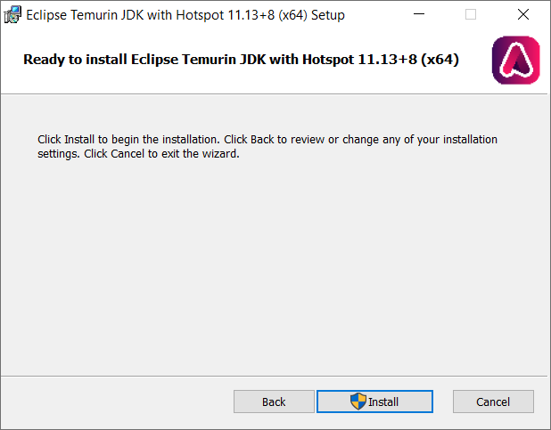

# WiX examples with OpenJDK distribution <a href="../README.md">⬆</a>

<table style="font-family:Helvetica,Arial;font-size:14px;line-height:1.6;">
  <tr>
  <td style="border:0;padding:0 10px 0 0;min-width:120px;">
    
  </td>
  <td style="border:0;padding:0;vertical-align:text-top;">
    Directory <strong><code>openjdk-examples\</code></strong> contains <a href="https://wixtoolset.org/" rel="external">WiX</a> examples written by ourself to create an <a href="https://www.scala-lang.org/" rel="external">OpenJDK</a> Windows installer.
  </td>
  </tr>
</table>

The mission of the [Eclipse Adoptium](https://projects.eclipse.org/projects/adoptium) project is to provide an open and reproducible build and test system for [OpenJDK source](https://github.com/openjdk/jdk) across multiple platforms.

That includes the development of a [WiX installer](https://github.com/adoptium/installer/tree/master/wix) (see GitHub project [`adoptium/installer`][adoptium_installer]) *configurable* for various OpenJDK implementations.

## OpenJDK

Project `OpenJDK` is derived from the [WiX][wix_toolset] installer developed in the project [`adoptium/installer`][adoptium_installer].

> **:mag_right:** Localization and resource files are the same as well as the source file [`src\Main.wxs`](./OpenJDK/src/Main.wxs) *but* we do not have a source file `src\Fragments.wxs` as in the Adoptium project. GUID values are stored in a separate file named `app\OpenJDK-11.0.13_8.txt` (directory `app\` is *ignored* by [`git`][git_cmd]) and inserted into the generated WiX file `target\src_gen\Fragments.wxs` before calling the [`candle`][wix_candle] tool (compiler).

The project directory is organized as follows :
<pre style="font-size:80%;">
<b>&gt; <a href="https://docs.microsoft.com/en-us/windows-server/administration/windows-commands/cd">cd</a></b>
Y:\openjdk-examples\<a href="./OpenJDK">OpenJDK</a>
&nbsp;
<b>&gt; <a href="https://docs.microsoft.com/en-us/windows-server/administration/windows-commands/tree">tree</a> /f . | <a href="https://docs.microsoft.com/en-us/windows-server/administration/windows-commands/findstr">findstr</a> /v /b [a-z]</b>
│   <a href="./OpenJDK/00download.txt">00download.txt</a>
│   <a href="./OpenJDK/build.bat">build.bat</a>
├───<b>app</b>
│   ├───<b><i>OpenJDK-11.0.13_8</i></b>
│   │      <i>(files extracted from</i> <a href="https://adoptium.net/archive.html?variant=openjdk11&jvmVariant=hotspot">OpenJDK11U-jdk_x64_windows_hotspot_11.0.13_8.zip</a><i>)</i>
│   ├───<b><i>OpenJDK-17.0.1_12</i></b>
│   │      <i>(files extracted from</i> <a href="https://adoptium.net/archive.html?variant=openjdk17&jvmVariant=hotspot">OpenJDK17U-jdk_x64_windows_hotspot_17.0.1_12.zip</a><i>)</i>
│   └───<b><i>OpenJDK-8u312b07</i></b>
│          <i>(files extracted from</i> <a href="https://adoptium.net/archive.html?variant=openjdk8&jvmVariant=hotspot">OpenJDK11U-jdk_x64_windows_hotspot_8u312b07.zip</a><i>)</i>
│       <i>OpenJDK-11.0.13_8.txt</i>
│       <i>OpenJDK-17.0.1_12.txt</i>
│       <i>OpenJDK-8u312b07.txt</i>
└───<a href="./OpenJDK/src/"><b>src</b></a>
    │   <a href="./OpenJDK/src/Includes.wxi">Includes.wxi</a>
    │   <a href="./OpenJDK/src/Main.wxs">Main.wxs</a>
    ├───<a href="./OpenJDK/src/localizations/"><b>localizations</b></a>
    │       <a href="./OpenJDK/src/localizations/OpenJDK.Base.en-us.wxl">OpenJDK.Base.en-us.wxl</a>
    │       <a href="./OpenJDK/src/localizations/OpenJDK.Base.fr-fr.wxl">OpenJDK.Base.fr-fr.wxl</a>
    │       <a href="./OpenJDK/src/localizations/OpenJDK.hotspot.en-us.wxl">OpenJDK.hotspot.en-us.wxl</a>
    │       <a href="./OpenJDK/src/localizations/OpenJDK.hotspot.fr-fr.wxl">OpenJDK.hotspot.fr-fr.wxl</a>
    │       <a href="./OpenJDK/src/localizations/OpenJDK.openj9.en-us.wxl">OpenJDK.openj9.en-us.wxl</a>
    │       <a href="./OpenJDK/src/localizations/OpenJDK.openj9.fr-fr.wxl">OpenJDK.openj9.fr-fr.wxl</a>
    └───<a href="./OpenJDK/src/resources/"><b>resources</b></a>
            <a href="./OpenJDK/src/resources/license-GPLv2+CE.en-us.rtf">license-GPLv2+CE.en-us.rtf</a>
            <a href="./OpenJDK/src/resources/license-OpenJ9.en-us.rtf">license-OpenJ9.en-us.rtf</a>
            <a href="./OpenJDK/src/resources/logo.ico">logo.ico</a>
            <a href="./OpenJDK/src/resources/wix-banner.bmp">wix-banner.bmp</a>
            <a href="./OpenJDK/src/resources/wix-dialog.bmp">wix-dialog.bmp</a>
</pre>

> **:mag_right:** Command [`build.bat`](./OpenJDK/build) reads the build configuration from file `build.properties` [1](#footnote_01), e.g.
> <pre style="font-size:80%;">
> <b>&gt; <a href="https://docs.microsoft.com/en-us/windows-server/administration/windows-commands/type">type</a> build.properties</b>
> PRODUCT_MAJOR_VERSION=11
> PRODUCT_MINOR_VERSION=0
> PRODUCT_MAINTENANCE_VERSION=13
> PRODUCT_PATCH_VERSION=0
> PRODUCT_BUILD_NUMBER=8
> PRODUCT_UPGRADE_CODE=&lt;guid-for-version-11&gt;
> # ARCH=x64|x86-32|arm64 or all "x64 x86-32 arm64"
> ARCH=x64
> # JVM=hotspot|openj9|dragonwell or both JVM=hotspot openj9
> JVM=hotspot
> # PRODUCT_CATEGORY=jre|jdk (only one at a time)
> PRODUCT_CATEGORY=jdk
> # Add -sval option to light.exe to skip MSI/MSM validation and skip smoke.exe )
> SKIP_MSI_VALIDATION=true
> #
> BUNDLE_ICEDTEAWEB=false
> </pre>

Command [`build link`](./OpenJDK/build.bat) [2](#footnote_02) generates the [OpenJDK 11][adoptium_openjdk11] Windows installer with file name `OpenJDK11U-jdk_x64_windows_hotspot_11.0.13_8.msi` [3](#footnote_03) based on the properties defined in file `build.properties`.

<pre style="font-size:80%;">
<b>&gt; <a href="./OpenJDK/build.bat">build</a> -verbose clean link</b>
Delete directory "target"
Generate auxiliary file "target\src_gen\Fragments.wxs.txt"
Saved 497 component identifiers to file "target\src_gen\Fragments.cid.txt"
ECHO is off.
Execute PS1 script "target\replace.ps1"
Compiling 2 WiX source files to directory "target"
Create Windows installer "target\OpenJDK11U-jdk_x64_windows_hotspot_11.0.13_8.msi"
</pre>

The output directory `target\` looks as follows :

<pre style="font-size:80%;">
<b>&gt; <a href="https://docs.microsoft.com/en-us/windows-server/administration/windows-commands/dir">dir</a> /a-d /b target</b>
candle_opts.txt
candle_sources.txt
Fragments.wixobj
light_opts.txt
Main.wixobj
OpenJDK11U-jdk_x64_windows_hotspot_11.0.13_8.msi
OpenJDK11U-jdk_x64_windows_hotspot_11.0.13_8.msi.md5
OpenJDK11U-jdk_x64_windows_hotspot_11.0.13_8.msi.sha256
OpenJDK11U-jdk_x64_windows_hotspot_11.0.13_8.wixpdb
replace.ps1
</pre>

Figures **1.1** to **1.4** below illustrate the dialog windows of our [OpenJDK 11][adoptium_openjdk11] Windows installer while figures **1.5** and **1.6** show the updated user environment after the successful execution of the Windows installer.

<table>
<tr>
<td style="text-align:center;">
  
  

  <b>Figure 1.1 -</b> Welcome (<i>OpenJDK 11</i> installer). &nbsp;
  

  
  

  <b>Figure 1.2 -</b> Custom setup (<i>OpenJDK 11</i> installer).
  

</td>
<td style="text-align:center;">
  
  
<b>Figure 1.3 -</b> Ready (<i>OpenJDK 11</i> installer). &nbsp;
  

  
  

  <b>Figure 1.4 -</b> Completed installation (<i>OpenJDK 11</i> installer).
  

</td>
<td>
  
  

  <b>Figure 1.5 -</b> <i>OpenJDK 11</i> directory (<i>Program&nbsp;Files</i> folder). &nbsp;
  

  
  

  <b>Figure 1.6 -</b> Uninstall (<i>Settings</i> window).
  

</td>
</tr>
</table>

## Footnotes

[1] ***Configuration file* `build.properties`** [↩](#anchor_01)

<dl><dd>
We can adapt the properties as follow in order to create an <a href="https://adoptium.net/?variant=openjdk17&jvmVariant=hotspot">OpenJDK 17</a> Windows installer :
</dd>
<dd>
<pre style="font-size:80%;">
# OpenJDK 17.0.1.12
PRODUCT_MAJOR_VERSION=17
PRODUCT_MINOR_VERSION=0
PRODUCT_MAINTENANCE_VERSION=1
PRODUCT_PATCH_VERSION=0
PRODUCT_BUILD_NUMBER=12
PRODUCT_UPGRADE_CODE=&lt;guid-for-version-17&gt;
</pre>
</dd>
<dd>
Similarly we can adapt the properties as follows to create an <a href="https://adoptium.net/?variant=openjdk8&jvmVariant=hotspot">OpenJDK 1.8</a> Windows installer :
</dd>
<dd>
<pre style="font-size:80%;">
# OpenJDK 1.8 (aka 8u312b07)
PRODUCT_MAJOR_VERSION=8
PRODUCT_MINOR_VERSION=0
PRODUCT_MAINTENANCE_VERSION=312
PRODUCT_PATCH_VERSION=0
PRODUCT_BUILD_NUMBER=07
PRODUCT_UPGRADE_CODE=&lt;guid-for-version-8&gt;
</pre>
</dd></dl>

[2] ***Batch file* `build.bat`** [↩](#anchor_02)

<dl><dd>
Command <a href="./OpenJDK/build.bat"><code>build help</code></a> displays the batch file options and subcommands :
</dd>
<dd>
<pre style="font-size:80%;">
<b>&gt; <a href="./OpenJDK/build.bat">build</a> help</b>
Usage: build { &lt;option&gt; | &lt;subcommand&gt; }
&nbsp;
  Options:
    -debug       show commands executed by this script
    -timer       display total execution time
    -verbose     display progress messages
&nbsp;
  Subcommands:
    clean        delete generated files
    help         display this help message
    install      execute Windows installer OpenJDK
    link         create Windows installer from WXS/WXI/WXL files
    remove       remove installed program (same as uninstall)
    uninstall    remove installed program
</pre>
</dd></dl>

[3] ***File naming conventions*** [↩](#anchor_03)

<dl><dd>
For instance the name of file <code>OpenJDK11U-jdk_x64_windows_hotspot_11.0.13_8.msi</code> can be decomposed as follows (see also the Swagger descriptions of the <a href="https://api.adoptium.net/q/swagger-ui/#/Installer">OpenAPI UI</a>):
</dd>
<dd>
<table>
<tr>
   <th>Name&nbsp;part</th>
   <th>Description</th>
   <th>Values</th>
</tr>
<tr>
  <td><code>OpenJDK</code></td>
  <td>Product SKU</td>
  <td><code>OpenJDK</code></td>
</tr>
<tr>
  <td><code>11</code></td>
  <td>Product major version</td>
  <td><code>8</code>, <code>11</code>, <code>17</code></td>
</tr>
<tr>
  <td><code>U</code></td>
  <td>Update release</td>
  <td><code>U</code></td>
</tr>
<tr>
  <td><code>jdk</code></td>
  <td>Product category</td>
  <td><code>jdk</code>, <code>jre</code></td>
</tr>
<tr>
  <td><code>x64</code></td>
  <td>Target architecture</td>
  <td><code>aarch64</code>, <code>arm64</code>, <code>ppc64</code>, <code>s390x</code>, <code>x64</code>, <code>x86_32</code></td>
</tr>
<tr>
  <td><code>windows</code></td>
  <td>Target platform</td>
  <td><code>aix</code>, <code>alpine-linux</code>,<code>arm_linux</code>, <code>linux</code>, <code>mac</code>, <code>windows</code></td>
</tr>
<tr>
  <td><code>hotspot</code></td>
  <td>JVM variant</td>
  <td><code>hotspot</code>, <code>openj9</code>, <code>dragonwell</code></td>
</tr>
<tr>
  <td><code>11.0.13_8</code> &nbsp; <code>8u312b07</code></td>
  <td>Product&nbsp;version</td>
  <td><code>&lt;major&gt;.&lt;minor&gt;.&lt;maintenance&gt;_&lt;build&gt;</code> <b>NB.</b> prior to Java 10 written : <code>&lt;major&gt;u&lt;maintenance&gt;b&lt;build&gt;</code></td>
</tr>
<tr>
  <td><code>msi</code></td>
  <td>File extension</td>
  <td><code>msi</code>, <code>zip</code></td>
</tr>
</table>
</dd></dl>

***

*[mics](https://lampwww.epfl.ch/~michelou/)/April 2022* [**&#9650;**](#top)
&nbsp;

<!-- link refs -->

[adoptium_installer]: https://github.com/adoptium/installer
[adoptium_openjdk11]: https://adoptium.net/?variant=openjdk11&jvmVariant=hotspot
[adoptium_openjdk17]: https://adoptium.net/?variant=openjdk17&jvmVariant=hotspot
[adoptium_openjdk8]: https://adoptium.net/?variant=openjdk8&jvmVariant=hotspot
[git_cmd]: https://docs.gitlab.com/ee/gitlab-basics/start-using-git.html
[wix_candle]: https://wixtoolset.org/documentation/manual/v3/overview/candle.html
[wix_component]: https://wixtoolset.org/documentation/manual/v3/xsd/wix/component.html
[wix_heat]: https://wixtoolset.org/documentation/manual/v3/overview/heat.html
[wix_light]: https://wixtoolset.org/documentation/manual/v3/overview/light.html
[wix_toolset]: https://wixtoolset.org/
