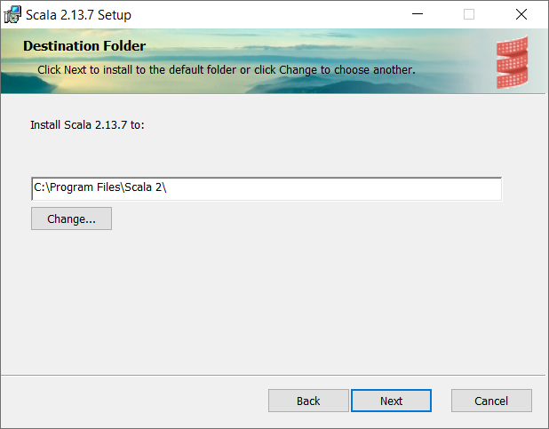

# WiX examples with Scala 2 distribution <a href="../README.md">⬆</a>

<table style="font-family:Helvetica,Arial;font-size:14px;line-height:1.6;">
  <tr>
  <td style="border:0;padding:0 10px 0 0;min-width:120px;">
    
  </td>
  <td style="border:0;padding:0;vertical-align:text-top;">
    Directory <strong><code>scala2-examples\</code></strong> contains <a href="https://wixtoolset.org/" rel="external">WiX</a> examples written by ourself to create a <a href="https://www.scala-lang.org/">Scala 2</a> Windows installer.
  </td>
  </tr>
</table>

The [WiX][wix_toolset] examples presented in the following sections
- share the same characteristics as the [WiX][wix_toolset] examples from page [examples/README.md](../examples/README.md).
- generate the file `target\src\gen\Fragments.wxs` [1](#footnote_01) which basically contains a *list of links* to the application files. 

## Scala2First

Project `Scala2First` is our first iteration to create a Windows installer (aka. `.msi` file) for the [Scala 2][scala2_releases] software distribution.

The project directory is organized as follows :
<pre style="font-size:80%;">
<b>&gt; <a href="https://docs.microsoft.com/en-us/windows-server/administration/windows-commands/cd">cd</a></b>
Y:\examples\Scala2First
&nbsp;
<b>&gt; <a href="https://docs.microsoft.com/en-us/windows-server/administration/windows-commands/tree">tree</a> /f . | <a href="https://docs.microsoft.com/en-us/windows-server/administration/windows-commands/findstr">findstr</a> /v /b [a-z]</b>
│   <a href="./Scala2First/build.bat">build.bat</a>
├───<b>app</b>
│   └───<i>files extracted from</i> <a href="https://www.scala-lang.org/download/2.13.7.html"><b>scala-2.13.7.zip</b></a>
└───<b>src</b>
    │   <a href="./Scala2First/src/Scala2First.wxs">Scala2First.wxs</a>
    └───<b>resources</b>
            favicon.ico
            <a href="./Scala2First/src/resources/repl.bat">repl.bat</a>
</pre>

> **:mag_right:** During installation the batch file [`src\resources\repl.bat`](./Scala2First/src/resources/repl.bat) is added to the `bin\` directory; the goal of that wrapper script is to look for a Java installation [1](#footnote_01) before starting the Scala 2 REPL (Scala commands require either variable **`JAVA_HOME`** or variable **`JAVACMD`** to be defined).

Command [`build link`](./Scala2First/build.bat) generates the [Scala 2][scala2] Windows installer with file name `scala-2.13.7.msi`.

> **:mag_right:** Command [`build help`](./Scala2First/build.bat) displays the batch file options and subcommands:

<pre style="font-size:80%;">
<b>&gt; <a href="./Scala2First/build.bat">build</a> clean link &amp;&amp; <a href="https://docs.microsoft.com/en-us/windows-server/administration/windows-commands/tree">tree</a> /f target | <a href="https://docs.microsoft.com/en-us/windows-server/administration/windows-commands/findstr">findstr</a> /v /b [a-z]</b>
│   candle_opts.txt
│   candle_sources.txt
│   Fragments.wixobj
│   light_opts.txt
│   scala-2.13.7.msi
│   scala-2.13.7.wixpdb
│   Scala2First.wixobj
├───<b>resources</b>
│       favicon.ico
│       repl.bat
└───<b>src_gen</b>
        Fragments-cid.txt  <i>(component identifier list)</i>
        Fragments.wxs
        Scala2First.wxs
</pre>

> **:mag_right:** The above file `target\src_gen\Scala2First.wxs` contains the real GUIDs instead of the symbol names defined in source file [`src\Scala2First.wxs`](./Scala2First/src/Scala2First.wxs).

Figures **1.1** to **1.4** below illustrate the updated user environment after the successful execution of the [Scala 2][scala2] Windows installer.

<table>
<tr>
<td style="text-align:center;">
  

  
  
<b>Figure 1.1 -</b> <i>Scala 2</i> directory (<i>Program Files</i> folder). &nbsp;
  

  

  
  
<b>Figure 1.2 -</b> <i>Scala 2</i> shortcuts (<i>Start Menu</i> folder).
  

</td>
<td style="text-align:center;">
  

  
  
<b>Figure 1.3 -</b> <i>Scala 2</i> REPL (<i>Start Menu</i> folder). &nbsp;
  

</td>
<td style="text-align:center;">
  
  
<b>Figure 1.4 -</b> Uninstall <i>Scala 2</i> (<i>Settings</i> window).
</td>
</tr>
</table>

## Scala2Sbt

Project `Scala2Sbt` [2](#footnote_02) relies on the sbt [Windows Plugin][sbt_windows_plugin] to generate the [Scala 2][scala2] Windows installer; this is the way the [Scala team][lightbend_scala] at Lightbend publishes the [Scala 2][scala2] Windows installer (see [Scala Archive](https://www.scala-lang.org/files/archive/)).

Figures **2.1** to **2.4** below illustrate the dialog windows of the Windows installer while Figure **2.5** shows the updated user environment after the successful execution of the [Scala 2][scala2] Windows installer.

<table>
<tr>
<td style="text-align:center;">
  

  
  
<b>Figure 2.1 -</b> Welcome (<i>Scala 2</i> installer). &nbsp;
  

  

  
  
<b>Figure 2.2 -</b> License (<i>Scala 2</i> installer).
  

</td>
<td style="text-align:center;">
  

  
  
<b>Figure 2.3 -</b> Custom Setup (<i>Scala 2</i> installer). &nbsp;
  

  

  
  
<b>Figure 2.4 -</b> Completed Installation (<i>Scala 2</i> installer).
  

</td>
<td style="text-align:center;">
  

  
  
<b>Figure 2.5 -</b> <i>Scala 2</i> directory (<i>Program Files (x86)</i> folder).
  

</td>
</tr>
</table>

## Scala2UI

Project `Scala2UI` [2](#footnote_02) ...

*wip*

Command [`build link`](./Scala2UI/build.bat) generates the [Scala 2][scala2] Windows installer with file name `scala-2.13.7.msi`.

<pre style="font-size:80%;">
<b>&gt; <a href="./Scala2UI/build.bat">build</a> -verbose link && tree /f target | findstr /v /b [a-z]</b>
Generate auxiliary file "target\src_gen\Fragments.wxs.txt"
Saved 40 component identifiers to file "target\src_gen\Fragments-cid.txt"
Execute PS1 script "target\replace.ps1"
Copy .bat files to directory "target\resources"
Copy .ico files to directory "target\resources"
Use banner image found in directory "src\resources"
Add logo to top banner image "target\resources\BannerTop.bmp"
Add logo to dialog image "target\resources\Dialog.bmp"
Compiling 2 WiX source files to directory "target"
Create Windows installer "target\scala-2.13.7.msi"
│   candle_opts.txt
│   candle_sources.txt
│   Fragments.wixobj
│   light_opts.txt
│   replace.ps1
│   scala-2.13.7.msi
│   scala-2.13.7.wixpdb
│   Scala2UI.wixobj
├───<b>resources</b>
│       BannerTop.bmp
│       Dialog.bmp
│       favicon.ico
│       network.ico
│       repl.bat
└───<b>src_gen</b>
        Fragments-cid.txt
        Fragments.wxs
        Includes.wxi
        Scala2UI.wxs
</pre>

Figures **3.1** to **3.4** below illustrate the dialog windows of our Windows installer while Figures **3.5** and **3.6** show the updated user environment after the successful execution of the [Scala 2][scala2] Windows installer.

<table>
<tr>
<td style="text-align:center;">
  

  
  
<b>Figure 3.1 -</b> Welcome (<i>Scala 2</i> installer). &nbsp;
  

  

  
  
<b>Figure 3.2 -</b> License (<i>Scala 2</i> installer).
  

</td>
<td style="text-align:center;">
  

  
  
<b>Figure 3.3 -</b> Destination folder (<i>Scala 2</i> installer). &nbsp;
  

  

  
  
<b>Figure 3.4 -</b> Completed Installation (<i>Scala 2</i> installer).
  

</td>
<td style="text-align:center;">
  

  
  
<b>Figure 3.5 -</b> <i>Scala 2</i> directory (<i>Program Files</i> folder). &nbsp;
  

  

  
  
<b>Figure 3.6 -</b> <i>Scala 2</i> directory (<i>Start Menu</i> folder).
  

</td>
</tr>
</table>

## Scala2Localized

Project `Scala2Localized` [2](#footnote_02) adds language localization to the [WiX][wix_toolset] source files of the [Scala 2][scala2] Windows installer.

## Footnotes

<b name="footnote_01">[1]</b> **`Fragments.wxs`** [↩](#anchor_01)

In the above projects we not just call the <a href="https://wixtoolset.org/documentation/manual/v3/overview/heat.html"><code>heat</code></a> tool to generate the file <code>target\src_gen\Fragments.wxs</code>, we also specify the option <code>-t <a href="./Scala2UI/src/resources/Fragments.xslt">src\resources\Fragments.xslt</a></code> to apply a few XML transformations to the generated <a href="https://wixtoolset.org/">WiX</a> source file.

<b name="footnote_02">[2]</b> ***Environment variables*** [↩](#anchor_02)

Unlike the first project <code>Scala2First</code> the following projects <code>Scala2Sbt</code>, <code>Scala2UI</code> and <code>Scala2Localized</code> generate a <a href="https://www.scala-lang.org/">Scala 2</a> Windows installer which will <i>update</i> the user environment as follows :

<pre style="margin:0 0 1em 20px;font-size:80%;">
<b>&gt; <a href="https://docs.microsoft.com/en-us/windows-server/administration/windows-commands/set_1">set</a> | <a href="https://docs.microsoft.com/en-us/windows-server/administration/windows-commands/findstr">findstr</a> SCALA</b>
SCALA_HOME=C:\Program Files\Scala 2\
&nbsp;
<b>&gt; <a href="https://docs.microsoft.com/en-us/windows-server/administration/windows-commands/where">where</a> scala</b>
C:\Program Files\Scala 2\bin\scala
C:\Program Files\Scala 2\bin\scala.bat
</pre>

***

*[mics](https://lampwww.epfl.ch/~michelou/)/November 2021* [**&#9650;**](#top)
&nbsp;

<!-- link refs -->

[firegiant]: https://www.firegiant.com/
[lightbend_scala]: https://www.lightbend.com/blog/scala-center
[microsoft_powershell]: https://docs.microsoft.com/en-us/powershell/scripting/getting-started/getting-started-with-windows-powershell?view=powershell-6
[sbt_windows_plugin]: https://www.scala-sbt.org/sbt-native-packager/formats/windows.html
[scala2]: https://www.scala-lang.org/
[scala2_releases]: https://github.com/scala/scala/releases
[windows_program_files]: https://en.wikipedia.org/wiki/Program_Files
[windows_settings]: https://support.microsoft.com/en-us/windows/find-settings-in-windows-10-6ffbef87-e633-45ac-a1e8-b7a834578ac6
[windows_start_menu]: https://support.microsoft.com/en-us/windows/see-what-s-on-the-start-menu-a8ccb400-ad49-962b-d2b1-93f453785a13
[wix_candle]: https://wixtoolset.org/documentation/manual/v3/overview/candle.html
[wix_component]: https://wixtoolset.org/documentation/manual/v3/xsd/wix/component.html
[wix_heat]: https://wixtoolset.org/documentation/manual/v3/overview/heat.html
[wix_light]: https://wixtoolset.org/documentation/manual/v3/overview/light.html
[wix_toolset]: https://wixtoolset.org/
