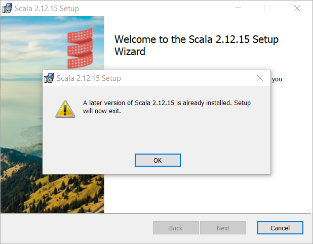

# WiX examples with Scala 2 distribution <a href="../README.md">⬆</a>

<table style="font-family:Helvetica,Arial;font-size:14px;line-height:1.6;">
  <tr>
  <td style="border:0;padding:0 10px 0 0;min-width:120px;">
    
  </td>
  <td style="border:0;padding:0;vertical-align:text-top;">
    Directory <strong><code>scala2-examples\</code></strong> contains <a href="https://wixtoolset.org/" rel="external">WiX</a> examples written by ourself to create a <a href="https://www.scala-lang.org/" rel="external">Scala 2</a> Windows installer. Follow <a href="../scala3-examples/README.md">this link</a> if you're looking for the Scala 3 Windows installer.
  </td>
  </tr>
</table>

The [WiX][wix_toolset] examples presented in the following sections
- *share* the same project organisation as the [WiX][wix_toolset] examples from page [`myexamples/README.md`](../myexamples/README.md).
- *differ* in several respects from the [WiX][wix_toolset] examples from page [`myexamples/README.md`](../myexamples/README.md), in particular :
   - application files are downloaded and extracted from the Zip archive (e.g. [`scala-2.13.7.zip`][scala2_zip]) if not yet present in directory `app\`.
   - we *do not* maintain a source file `Fragments.wxs` in directory `src\`; the file `target\src_gen\Fragments.wxs` [1](#footnote_01) ‒ which contains a *list of links* to the application files ‒ is generated on each run with GUID values inserted on the fly. 

The [Scala 2][scala2] Windows installer behaves in *3 different ways* when it detects a [Scala 2][scala2] installation on the target machine (see [WiX element `MajorUpgrade`](https://wixtoolset.org/documentation/manual/v3/xsd/wix/majorupgrade.html)) :
- if the version to be installed is ***newer than*** the version found on the machine then the Windows installer removes the old version and install the new one.
- if the version to be installed is ***older than*** the version found on the machine then the [Windows installer does exit](./images/Scala2Features_LaterAlreadyInstalled.png).
- if the version to be installed is ***the same as*** the version found on the machine then the user is asked for a [change, repair or remove operation](./images/Scala2Features_ChangeOrRepair.png).

> **&#9755;** Visit our [Releases](https://github.com/michelou/wix-examples/releases) page to download and try the latest *self-signed* [Scala 2][scala2] Windows installer. The document [`SECURITY.md`](../SECURITY.md) provides more information about [*self-signed certificates*](https://en.wikipedia.org/wiki/Self-signed_certificate).

## Scala2First

Project `Scala2First` [2](#footnote_02) is our first iteration to create a Windows installer (aka. `.msi` file) for the [Scala 2][scala2_releases] software distribution.

The project directory is organized as follows :
<pre style="font-size:80%;">
<b>&gt; <a href="https://docs.microsoft.com/en-us/windows-server/administration/windows-commands/cd">cd</a></b>
Y:\scala2-examples\Scala2First
&nbsp;
<b>&gt; <a href="https://docs.microsoft.com/en-us/windows-server/administration/windows-commands/tree">tree</a> /f . | <a href="https://docs.microsoft.com/en-us/windows-server/administration/windows-commands/findstr">findstr</a> /v /b [a-z]</b>
│   <a href="./Scala2First/build.bat">build.bat</a>
├───<b>app</b>
│   ├───<b>scala-2.12.15</b>
│   │       <i>(files extracted from</i> <a href="https://scala-lang.org/files/archive/"><b>scala-2.12.15.zip</b></a><i>)</i>
│   └───<b>scala-2.13.7</b>
│           <i>(files extracted from</i> <a href="https://scala-lang.org/files/archive/"><b>scala-2.13.7.zip</b></a><i>)</i>
└───<b>src</b>
    │   <a href="./Scala2First/src/Scala2First.wxs">Scala2First.wxs</a>
    └───<b>resources</b>
            favicon.ico
            <a href="./Scala2First/src/resources/repl.bat">repl.bat</a>
</pre>

> **:mag_right:** During installation the batch file [`src\resources\repl.bat`](./Scala2First/src/resources/repl.bat) is added to the `bin\` directory; the goal of that wrapper script is to look for a Java installation [3](#footnote_03) before starting the Scala 2 REPL (Scala commands require either variable **`JAVA_HOME`** or variable **`JAVACMD`** to be defined).

Command [`build link`](./Scala2First/build.bat) [4](#footnote_04) generates the [Scala 2][scala2] Windows installer with file name `scala-2.13.7.msi`.

<pre style="font-size:80%;">
<b>&gt; <a href="./Scala2First/build.bat">build</a> clean link &amp;&amp; <a href="https://docs.microsoft.com/en-us/windows-server/administration/windows-commands/tree">tree</a> /f target | <a href="https://docs.microsoft.com/en-us/windows-server/administration/windows-commands/findstr">findstr</a> /v /b [a-z]</b>
│   candle_opts.txt
│   candle_sources.txt
│   Fragments.wixobj
│   light_opts.txt
│   scala-2.13.7.msi
│   scala-2.13.7.msi.md5
│   scala-2.13.7.msi.sha256
│   scala-2.13.7.wixpdb
│   Scala2First.wixobj
├───<b>resources</b>
│       favicon.ico
│       repl.bat
└───<b>src_gen</b>
        Fragments-cid.txt  <i>(component identifier list)</i>
        Fragments.wxs
        Scala2First.wxs
</pre>

> **:mag_right:** The above file `target\src_gen\Scala2First.wxs` contains the real GUIDs instead of the symbol names defined in source file [`src\Scala2First.wxs`](./Scala2First/src/Scala2First.wxs).

Figures **1.1** to **1.4** below illustrate the updated user environment after the successful execution of the [Scala 2][scala2] Windows installer.

<table>
<tr>
<td style="text-align:center;">
  

  
  
<b>Figure 1.1 -</b> <i>Scala 2</i> directory (<i>Program Files</i> folder). &nbsp;
  

  

  
  
<b>Figure 1.2 -</b> <i>Scala 2</i> shortcuts (<i>Start Menu</i> folder).
  

</td>
<td style="text-align:center;">
  

  
  
<b>Figure 1.3 -</b> <i>Scala 2</i> REPL (<i>Start Menu</i> folder). &nbsp;
  

</td>
<td style="text-align:center;">
  
  
<b>Figure 1.4 -</b> Uninstall <i>Scala 2</i> (<i>Settings</i> window).
</td>
</tr>
</table>

## Scala2Sbt

Project `Scala2Sbt` [2](#footnote_02) relies on the sbt [Windows Plugin][sbt_windows_plugin] to generate the [Scala 2][scala2] Windows installer; this is the way the [Scala team][lightbend_scala] at Lightbend publishes the [Scala 2][scala2] Windows installer (see [Scala Archive](https://www.scala-lang.org/files/archive/)).

Figures **2.1** to **2.4** below illustrate the dialog windows of the Windows installer while Figure **2.5** shows the updated user environment after the successful execution of the [Scala 2][scala2] Windows installer.

<table>
<tr>
<td style="text-align:center;">
  
  
<b>Figure 2.1 -</b> Welcome (<i>Scala 2</i> installer). &nbsp;
  

  
  
<b>Figure 2.2 -</b> License (<i>Scala 2</i> installer).
  

</td>
<td style="text-align:center;">
  
  
<b>Figure 2.3 -</b> Custom Setup (<i>Scala 2</i> installer). &nbsp;
  

  
  
<b>Figure 2.4 -</b> Completed Installation (<i>Scala 2</i> installer).
  

</td>
<td style="text-align:center;">
  
  
<b>Figure 2.5 -</b> <i>Scala 2</i> directory (<i>Program Files (x86)</i> folder).
  

</td>
</tr>
</table>

## Scala2UI

Project `Scala2UI` [2](#footnote_02) adds customizations to the graphical user interface of the [Scala 2][scala2] Windows installer. Concretely, we can define two images to customize the dialog windows of the Windows installer, ie. :
- image [`Dialog.bmp`](./Scala2UI/src/resources/Dialog.bmp) appears in the *Welcome* and *Completed* dialog windows.
- image [`BannerTop.bmp`](./Scala2UI/src/resources/BannerTop.bmp) appears at the top of the other dialog windows.

The project directory is organized as follows :
<pre style="font-size:80%;">
<b>&gt; <a href="https://docs.microsoft.com/en-us/windows-server/administration/windows-commands/cd">cd</a></b>
Y:\scala-examples\Scala2UI
&nbsp;
<b>&gt; <a href="https://docs.microsoft.com/en-us/windows-server/administration/windows-commands/tree">tree</a> /f . | <a href="https://docs.microsoft.com/en-us/windows-server/administration/windows-commands/findstr">findstr</a> /v /b [a-z]</b>
│   <a href="./Scala2UI/build.bat">build.bat</a>
├───<b>app</b>
│   ├───<b>scala-2.12.15</b>
│   │       <i>(files extracted from</i> <a href="https://scala-lang.org/files/archive/"><b>scala-2.12.15.zip</b></a><i>)</i>
│   └───<b>scala-2.13.7</b>
│           <i>(files extracted from</i> <a href="https://scala-lang.org/files/archive/"><b>scala-2.13.7.zip</b></a><i>)</i>
└───<a href="./Scala2UI/src/"><b>src</b></a>
    │   <a href="./Scala2UI/src/Includes.wxi">Includes.wxi</a>
    │   <a href="./Scala2UI/src/Scala2UI.wxs">Scala2UI.wxs</a>
    └───<a href="./Scala2UI/src/resources/"><b>resources</b></a>
            <a href="./Scala2UI/src/resources/BannerTop.bmp">BannerTop.bmp</a>
            <a href="./Scala2UI/src/resources/Dialog.bmp">Dialog.bmp</a>
            <a href="./Scala2UI/src/resources/favicon.ico">favicon.ico</a>
            <a href="./Scala2UI/src/resources/Fragments.xslt">Fragments.xslt</a>
            <a href="./Scala2UI/src/resources/License.rtf">License.rtf</a>
            <a href="./Scala2UI/src/resources/logo.svg">logo.svg</a>
            <a href="./Scala2UI/src/resources/LICENSE.rtf">LICENSE.rtf</a>
            <a href="./Scala2UI/src/resources/network.ico">network.ico</a>
            <a href="./Scala2UI/src/resources/repl.bat">repl.bat</a>
            <a href="./Scala2UI/src/resources/rtf.ico">rtf.ico</a>
</pre>

Command [`build link`](./Scala2UI/build.bat) generates the [Scala 2][scala2] Windows installer with file name `scala-2.13.7.msi`.

<pre style="font-size:80%;">
<b>&gt; <a href="./Scala2UI/build.bat">build</a> -verbose link && <a href="https://docs.microsoft.com/en-us/windows-server/administration/windows-commands/tree">tree</a> /f target | <a href="https://docs.microsoft.com/en-us/windows-server/administration/windows-commands/findstr">findstr</a> /v /b [a-z]</b>
Generate auxiliary file "target\src_gen\Fragments.wxs.txt"
Saved 40 component identifiers to file "target\src_gen\Fragments-cid.txt"
Execute PowerShell script "target\replace.ps1"
Copy .bat files to directory "target\resources"
Copy .ico files to directory "target\resources"
Use banner image found in directory "src\resources"
Add logo to top banner image "target\resources\BannerTop.bmp"
Add logo to dialog image "target\resources\Dialog.bmp"
Compiling 2 WiX source files to directory "target"
Create Windows installer "target\scala-2.13.7.msi"
│   candle_opts.txt
│   candle_sources.txt
│   Fragments.wixobj
│   light_opts.txt
│   replace.ps1
│   scala-2.13.7.msi
│   scala-2.13.7.msi.md5
│   scala-2.13.7.msi.sha256
│   scala-2.13.7.wixpdb
│   Scala2UI.wixobj
├───<b>resources</b>
│       BannerTop.bmp
│       Dialog.bmp
│       favicon.ico
│       License.rtf
│       network.ico
│       repl.bat
│       rtf.ico
└───<b>src_gen</b>
        Fragments-cid.txt
        Fragments.wxs
        Includes.wxi
        Scala2UI.wxs
</pre>

Figures **3.1** to **3.4** below illustrate the dialog windows of our Windows installer while Figures **3.5** and **3.6** show the updated user environment after the successful execution of the [Scala 2][scala2] Windows installer.

<table>
<tr>
<td style="text-align:center;">
  
  
<b>Figure 3.1 -</b> Welcome (<i>Scala 2</i> installer). &nbsp;
  

  
  
<b>Figure 3.2 -</b> EULA (<i>Scala 2</i> installer).
  

</td>
<td style="text-align:center;">
  
  
<b>Figure 3.3 -</b> Destination folder (<i>Scala 2</i> installer). &nbsp;
  

  
  
<b>Figure 3.4 -</b> Completed Installation (<i>Scala 2</i> installer).
  

</td>
<td style="text-align:center;">
  
  
<b>Figure 3.5 -</b> <i>Scala 2</i> directory (<i>Program Files</i> folder). &nbsp;
  

  
  
<b>Figure 3.6 -</b> <i>Scala 2</i> directory (<i>Start Menu</i> folder).
  

</td>
</tr>
</table>

## Scala2Localized

Project `Scala2Localized` [2](#footnote_02) adds language localization to the [WiX][wix_toolset] source files of the [Scala 2][scala2] Windows installer.

This project contains the additional directory [`src\localizations\`](./Scala2Localized/src/localizations/) with 4 [WiX localization files](https://wixtoolset.org//documentation/manual/v3/wixui/wixui_localization.html):

<pre style="font-size:80%;">
<b>&gt; <a href="https://docs.microsoft.com/en-us/windows-server/administration/windows-commands/cd">cd</a></b>
Y:\scala2-examples\Scala2Localized
&nbsp;
<b>&gt; <a href="https://docs.microsoft.com/en-us/windows-server/administration/windows-commands/tree">tree</a> /f . | <a href="https://docs.microsoft.com/en-us/windows-server/administration/windows-commands/findstr">findstr</a> /v /b [a-z]</b>
│   <a href="./Scala2Localized/build.bat">build.bat</a>
├───<b>app</b>
│   ├───<b>scala-2.12.15</b>
│   │       <i>(files extracted from</i> <a href="https://scala-lang.org/files/archive/"><b>scala-2.12.15.zip</b></a><i>)</i>
│   └───<b>scala-2.13.7</b>
│           <i>(files extracted from</i> <a href="https://scala-lang.org/files/archive/"><b>scala-2.13.7.zip</b></a><i>)</i>
└───<a href="./Scala2Localized/src/"><b>src</b></a>
    │   <a href="./Scala2Localized/src/Includes.wxi">Includes.wxi</a>
    │   <a href="./Scala2Localized/src/Scala2Localized.wxs">Scala2Localized.wxs</a>
    ├───<a href="./Scala2Localized/src/localizations/"><b>localizations</b></a>
    │       <a href="./Scala2Localized/src/localizations/de-DE.wxl">de-DE.wxl</a>
    │       <a href="./Scala2Localized/src/localizations/en-US.wxl">en-US.wxl</a>
    │       <a href="./Scala2Localized/src/localizations/fr-FR.wxl">fr-Fr.wxl</a>
    │       <a href="./Scala2Localized/src/localizations/sv-SE.wxl">sv-SE.wxl</a>
    └───<a href="./Scala2Localized/src/resources/"><b>resources</b></a>
            <a href="./Scala2Localized/src/resources/BannerTop.bmp">BannerTop.bmp</a>
            <a href="./Scala2Localized/src/resources/Dialog.bmp">Dialog.bmp</a>
            <a href="./Scala2Localized/src/resources/favicon.ico">favicon.ico</a>
            <a href="./Scala2Localized/src/resources/Fragments.xslt">Fragments.xslt</a>
            <a href="./Scala2Localized/src/resources/LICENSE.rtf">LICENSE.rtf</a>
            <a href="./Scala2Localized/src/resources/logo.svg">logo.svg</a>
            <a href="./Scala2Localized/src/resources/network.ico">network.ico</a>
            <a href="./Scala2Localized/src/resources/repl.bat">repl.bat</a>
            <a href="./Scala2Localized/src/resources/rtf.ico">rtf.ico</a>
</pre>

Command [`build link`](./Scala2Localized/build.bat) generates a separate MSI file for each language localization, e.g. `scala-2.13.7-sv-SE.msi` is the swedish version of the [Scala 2][scala2] Windows installer.

<pre style="font-size:80%;">
<b>&gt; <a href="./Scala2Localized/build.bat">build</a> clean link && <a href="https://docs.microsoft.com/en-us/windows-server/administration/windows-commands/dir">dir</a> /b /a-d target</b>
candle_opts.txt
candle_sources.txt
Fragments.wixobj
light_opts.txt
replace.ps1
<b>scala-2.13.7.msi</b>
scala-2.13.7.msi.md5
scala-2.13.7.msi.sha256
scala-2.13.7.wixpdb
<b>scala-2.13.7_de-DE.msi</b>
scala-2.13.7_de-DE.msi.md5
scala-2.13.7_de-DE.msi.sha256
scala-2.13.7_de-DE.wixpdb
<b>scala-2.13.7_fr-FR.msi</b>
scala-2.13.7_fr-FR.msi.md5
scala-2.13.7_fr-FR.msi.sha256
scala-2.13.7_fr-FR.wixpdb
<b>scala-2.13.7_sv-SE.msi</b>
scala-2.13.7_sv-SE.msi.md5
scala-2.13.7_sv-SE.msi.sha256
scala-2.13.7_sv-SE.wixpdb
Scala2Localized.wixobj
</pre>

Figures **4.1** to **4.4** below illustrate the "**Welcome**" dialog window of the [Scala 2][scala2] Windows installer in english, german, french and swedish.

<table>
<tr>
<td style="text-align:center;">
  
  
<b>Figure 4.1 -</b> Welcome (<i>english</i> version). &nbsp;
  

  
  
<b>Figure 4.2 -</b> Willkommen (<i>german</i> version).
  

</td>
<td style="text-align:center;">
  
  
<b>Figure 4.3 -</b> Bienvenue (<i>french</i> version). &nbsp;
  

  
  
<b>Figure 4.4 -</b> Välkommen (<i>swedish</i> version).
  

</td>
</tr>
</table>

## Scala2Features

Project `Scala2Features` [2](#footnote_02) adds feature customization to the [Scala 2][scala2] Windows installer.

Concretely the main [`Feature` element](https://wixtoolset.org/documentation/manual/v3/xsd/wix/feature.html) of the WiX source file [`Scala2Features.wxs`](./Scala2Features/src/Scala2Features.wxs) contains one mandatory `Feature` element and 3 optional `Feature` elements (attribute `Absent="allow"`): 

<pre style="font-size:80%;">
&lt;<b>Feature</b> Id="AppComponents" Absent="disallow" ...&gt;
  &lt;<b>Feature</b> Id="AppCore" Absent="disallow" ...&gt;
    &lt;<b>ComponentGroupRef</b> Id='PackFiles' /&gt;
    &lt;<b>ComponentRef</b> Id="ApplicationShortcuts" /&gt;
  &lt;/<b>Feature</b>&gt;
  &lt;<b>Feature</b> Id="ScalaHome" Absent="allow" ...&gt;
    &lt;<b>ComponentRef</b> Id="ApplicationScalaHome" /&gt;
  &lt;/<b>Feature</b>&gt;
  &lt;<b>Feature</b> Id="UpdatePath" Absent="allow" ...&gt;
    &lt;<b>ComponentRef</b> Id="ApplicationUpdatePath" /&gt;
  &lt;/<b>Feature</b>&gt;
  &lt;<b>Feature</b> Id="AppDocumentation" Absent="allow" ...&gt;
    &lt;<b>ComponentGroupRef</b> Id="APIFiles" /&gt;
    &lt;<b>ComponentRef</b> Id="DocumentationShortcuts" /&gt;
  &lt;/<b>Feature</b>&gt;
&lt;/<b>Feature</b>&gt;
</pre>

As before command [`build link`](./Scala3Features/build.bat) generates the MSI file [`scala-2.13.7.msi`](https://github.com/michelou/wix-examples/releases) with the two checksum files `scala-2.13.7.msi.md5` and `scala-2.13.7.msi.sha256`.

<pre style="font-size:80%;">
<b>&gt; <a href="./Scala2Features/build.bat">build</a> -verbose clean link</b>
Delete directory "target"
Generate auxiliary file "target\src_gen\Fragments.wxs"
Saved 41 component identifiers to file "target\src_gen\Fragments-cid.txt"
Execute PowerShell script "target\replace.ps1"
Copy .bat files to directory "target\resources"
Copy .ico files to directory "target\resources"
Use banner image found in directory "src\resources"
Add logo to banner image "target\resources\BannerTop.bmp"
Add logo to dialog image "target\resources\Dialog.bmp"
Set copyright information in file "target\resources\LICENSE.rtf"
Compiling 3 WiX source files to directory "target"
Create Windows installer "target\scala-2.13.7.msi"
</pre>

Figures **5.1** to **5.4** below illustrate the dialog windows of our Windows installer while Figures **5.5** and **5.6** show how the Windws installer behaves when a [Scala 2][scala2] installation is already present on the target machine.

<table>
<tr>
<td style="text-align:center;">
  
  
<b>Figure 5.1 -</b> Welcome (<i>Scala 2</i> installer). &nbsp;
  

  
  
<b>Figure 5.2 -</b> EULA (<i>Scala 2</i> installer).
  

</td>
<td style="text-align:center;">
  
  
<b>Figure 5.3 -</b> Custom Setup (<i>Scala 2</i> installer). &nbsp;
  

  
  
<b>Figure 5.4 -</b> Completed installation (<i>Scala 2</i> installer).
  

</td>

<td style="text-align:center;">
  
  
<b>Figure 5.5 -</b> Later version already installed (<i>Scala 2</i> installer). &nbsp;
  

  
  
<b>Figure 5.5 -</b> Change, repaire or remove (<i>Scala 2</i> installer).
  

</td>
</tr>
</table>

## Footnotes

[1] **`Fragments.wxs`** [↩](#anchor_01)

<dl><dd>
In the above projects we not just call the <a href="https://wixtoolset.org/documentation/manual/v3/overview/heat.html"><code>heat</code></a> tool to generate the file <code>target\src_gen\Fragments.wxs</code>, we also specify the option <code>-t <a href="./Scala2UI/src/resources/Fragments.xslt">src\resources\Fragments.xslt</a></code> to apply a few XML transformations to the generated <a href="https://wixtoolset.org/">WiX</a> source file (eg. addition of component element <code>"repl.bat"</code>).
</dd></dl>

[2] ***Environment variables*** [↩](#anchor_02)

<dl><dd>
The Scala 2 Windows installer generated in projects <code>Scala2Sbt</code>, <code>Scala2UI</code>,  <code>Scala2Localized</code> and <code>Scala2Features</code> (but <b><i>not</i></b> <code>Scala2First</code>) will <i>update</i> the system environment as follows :
</dd>
<dd>
<pre style="font-size:80%;">
<b>&gt; <a href="https://docs.microsoft.com/en-us/windows-server/administration/windows-commands/set_1">set</a> | <a href="https://docs.microsoft.com/en-us/windows-server/administration/windows-commands/findstr">findstr</a> SCALA</b>
SCALA_HOME=C:\Program Files\Scala 2\
&nbsp;
<b>&gt; <a href="https://docs.microsoft.com/en-us/windows-server/administration/windows-commands/where">where</a> scala</b>
C:\Program Files\Scala 2\bin\scala
C:\Program Files\Scala 2\bin\scala.bat
&nbsp;
<b>&gt; <a href="https://docs.microsoft.com/en-us/windows-server/administration/windows-commands/set_1">set</a> JAVA_HOME=c:\opt\<a href="https://bell-sw.com/pages/downloads/#/java-8-lts">jdk-bellsoft-1.8.0u312</a></b>
&nbsp;
<b>&gt; scala -version</b>
Scala code runner version 2.13.7 -- Copyright 2002-2021, LAMP/EPFL and Lightbend, Inc.
</pre>
</dd></dl>

[3] ***Default Java Location*** [↩](#anchor_03)

<dl><dd>
OpenJDK implementations are available either as Zip files (<code>.zip</code/>) or as Windows installers (<code>.msi</code>).
</dd>
<dd>
Unfortunately each Windows installer suggests a <i>different</i> default installation location <b>and</b> follows <i>inconsistent</i> naming conventions:
</dd>
<dd>
<table style="font-size:80%;">
<tr>
  <th style="padding:6px;">OpenJDK Implementation</th>
  <th style="padding:6px;">Default location in <code>%ProgramFiles%</code> folder</th>
</tr>
<tr>
  <td style="padding:6px;"><a href="https://github.com/corretto/corretto-11/releases">Amazon Corretto 11</a></td>
  <td style="padding:6px;"><code>Amazon Corretto\jdk11.0.13_8\</code></td>
</tr>
<tr>
  <td style="padding:6px;"><a href="https://github.com/corretto/corretto-17/releases">Amazon Corretto 17</a></td>
  <td style="padding:6px;"><code>Amazon Corretto\</code> <b>&#129092;&#129092;&#129092;</b></td>
</tr>
<tr>
  <td style="padding:6px;"><a href="https://www.azul.com/downloads/?version=java-8-lts&package=jdk">Azul Zulu 8</a></td>
  <td style="padding:6px;"><code>Zulu\zulu-8\</code></td>
</tr>
<tr>
  <td style="padding:6px;"><a href="https://www.azul.com/downloads/?version=java-11-lts&package=jdk">Azul Zulu 11</a></td>
  <td style="padding:6px;"><code>Zulu\zulu-11\</code></td>
</tr>
<tr>
  <td style="padding:6px;"><a href="https://www.azul.com/downloads/?version=java-17-lts&os=windows&architecture=x86-64-bit&package=jdk">Azul Zulu 17</a></td>
  <td style="padding:6px;"><code>Zulu\zulu-17\</code></td>
</tr>
<tr>
  <td style="padding:6px;"><a href="https://adoptium.net/?variant=openjdk8&jvmVariant=hotspot">Eclipse&nbsp;Temurin&nbsp;8</a></td>
  <td style="padding:6px;"><code>Eclipse Adoptium\jdk-8.0.312.7-hotspot\</code></td>
</tr>
<tr>
  <td style="padding:6px;"><a href="https://adoptium.net/?variant=openjdk11&jvmVariant=hotspot">Eclipse&nbsp;Temurin&nbsp;11</a></td>
  <td style="padding:6px;"><code>Eclipse Adoptium\jdk-11.0.13.8-hotspot\</code></td>
</tr>
<tr>
  <td style="padding:6px;"><a href="https://adoptium.net/?variant=openjdk17&jvmVariant=hotspot">Eclipse&nbsp;Temurin&nbsp;17</a></td>
  <td style="padding:6px;"><code>Eclipse Adoptium\jdk-17.0.1.12-hotspot\</code></td>
</tr>
<tr>
  <td style="padding:6px;"><a href="https://docs.microsoft.com/en-us/java/openjdk/download#openjdk-11">Microsoft 11</a></td>
  <td style="padding:6px;"><code>Microsoft\jdk-11.0.13.8-hotspot\</code></td>
</tr>
<tr>
  <td style="padding:6px;"><a href="https://docs.microsoft.com/en-us/java/openjdk/download#openjdk-17">Microsoft 17</a></td>
  <td style="padding:6px;"><code>Microsoft\jdk-17.0.1.12-hotspot\</code></td>
</tr>
<tr>
  <td style="padding:6px;"><a href="https://developers.redhat.com/products/openjdk/download">RedHat 8</a></td>
  <td style="padding:6px;"><code>RedHat\java-1.8.0-openjdk-1.8.0.312.2\</code></td>
</tr>
<tr>
  <td style="padding:6px;"><a href="https://developers.redhat.com/products/openjdk/download">RedHat 11</a></td>
  <td style="padding:6px;"><code>RedHat\java-11-openjdk-11.0.13-1\</code></td>
</tr>
<tr>
  <td style="padding:6px;"><a href="https://developers.redhat.com/products/openjdk/download">RedHat 17</a></td>
  <td style="padding:6px;"><code>RedHat\java-17-openjdk-17.0.1.0.12-1\</code></td>
</tr>
<tr>
  <td style="padding:6px;"><a href="https://sap.github.io/SapMachine/">SapMachine 11</a></td>
  <td style="padding:6px;"><code>SapMachine\JDK\11\</code></td>
</tr>
<tr>
  <td style="padding:6px;"><a href="https://sap.github.io/SapMachine/">SapMachine 17</a></td>
  <td style="padding:6px;"><code>SapMachine\JDK\17\</code></td>
</tr>
</table>
</dd></dl>

[4] ***Batch file* `build.bat`** [↩](#anchor_04)

<dl><dd>
Command <a href="./Scala2First/build.bat"><code>build help</code></a> displays the batch file options and subcommands :
</dd>
<dd>
<pre style="font-size:80%;">
<b>&gt; <a href="./Scala2First/build.bat">build</a> help</b>
Usage: build { &lt;option&gt; | &lt;subcommand&gt; }
&nbsp;
  Options:
    -debug       show commands executed by this script
    -timer       display total execution time
    -verbose     display progress messages
&nbsp;
  Subcommands:
    clean        delete generated files
    help         display this help message
    install      execute Windows installer scala
    link         create Windows installer from WXS/WXI/WXL files
    remove       remove installed program (same as uninstall)
    uninstall    remove installed program
</pre>
</dd></dl>

***

*[mics](https://lampwww.epfl.ch/~michelou/)/December 2021* [**&#9650;**](#top)
&nbsp;

<!-- link refs -->

[firegiant]: https://www.firegiant.com/
[lightbend_scala]: https://www.lightbend.com/blog/scala-center
[microsoft_powershell]: https://docs.microsoft.com/en-us/powershell/scripting/getting-started/getting-started-with-windows-powershell?view=powershell-6
[sbt_windows_plugin]: https://www.scala-sbt.org/sbt-native-packager/formats/windows.html
[scala2_zip]: https://scala-lang.org/files/archive/
[scala2]: https://www.scala-lang.org/
[scala2_releases]: https://github.com/scala/scala/releases
[windows_program_files]: https://en.wikipedia.org/wiki/Program_Files
[windows_settings]: https://support.microsoft.com/en-us/windows/find-settings-in-windows-10-6ffbef87-e633-45ac-a1e8-b7a834578ac6
[windows_start_menu]: https://support.microsoft.com/en-us/windows/see-what-s-on-the-start-menu-a8ccb400-ad49-962b-d2b1-93f453785a13
[wix_candle]: https://wixtoolset.org/documentation/manual/v3/overview/candle.html
[wix_component]: https://wixtoolset.org/documentation/manual/v3/xsd/wix/component.html
[wix_heat]: https://wixtoolset.org/documentation/manual/v3/overview/heat.html
[wix_light]: https://wixtoolset.org/documentation/manual/v3/overview/light.html
[wix_toolset]: https://wixtoolset.org/
