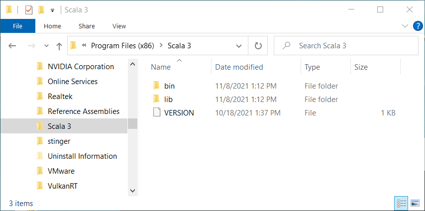

# Scala 3 Windows Installer <a href="../README.md">⬆</a>

<table style="font-family:Helvetica,Arial;font-size:14px;line-height:1.6;">
  <tr>
  <td style="border:0;padding:0 10px 0 0;min-width:120px;">
    
  </td>
  <td style="border:0;padding:0;vertical-align:text-top;">
    Directory <strong><code>scala3-examples\</code></strong> contains <a href="https://wixtoolset.org/" rel="external">WiX</a> examples written by myself for creating  [Scala 3][scala3] Windows installer.
  </td>
  </tr>
</table>

The [WiX][wix_toolset] projects presented in the following sections
- share the same characteristics with [WiX][wix_toolset] examples from page [examples/README.md](../examples/README.md).
- add a file `fragments.wxs` initially generated using the [`heat`][wix_heat] tool. 

## Scala3First

The `Scala3First` project is our first iteration to create a Windows installer (aka. MSI file) for the [Scala 3][scala3_releases] software distribution.

This project is organized as follows :
<pre style="font-size:80%;">
<b>&gt; <a href="https://docs.microsoft.com/en-us/windows-server/administration/windows-commands/cd">cd</a></b>
Y:\examples\Scala3First
&nbsp;
<b>&gt; <a href="https://docs.microsoft.com/en-us/windows-server/administration/windows-commands/tree">tree</a> /f . | <a href="https://docs.microsoft.com/en-us/windows-server/administration/windows-commands/findstr">findstr</a> /v /b [a-z]</b>
│   <a href="./Scala3First/build.bat">build.bat</a>
├───<b>app</b>
│   └───<i>files extracted from</i> <a href="https://github.com/lampepfl/dotty/releases/tag/3.1.0"><b>scala3-3.1.0.zip</b></a>
└───<b>src</b>
    │   <a href="./Scala3First/src/Fragments.wxs">Fragments.wxs</a>
    │   <a href="./Scala3First/src/Scala3First.wxs">Scala3First.wxs</a>
    └───<b>resources</b>
            favicon.ico
            <a href="./Scala3First/src/resources/repl.bat">repl.bat</a>
</pre>

> **:mag_right:** Command [`build help`](./Scala3First/build.bat) displays the batch file options and subcommands:

Command [`build link`](./Scala3First/build.bat) generates the Windows installer with name `Scala3First.msi`.

<pre style="font-size:80%;">
<b>&gt; <a href="./Scala3First/build.bat">build</a> clean link &amp;&amp; <a href="https://docs.microsoft.com/en-us/windows-server/administration/windows-commands/tree">tree</a> /f target | <a href="https://docs.microsoft.com/en-us/windows-server/administration/windows-commands/findstr">findstr</a> /v /b [a-z]</b>
│   candle_opts.txt
│   candle_sources.txt
│   Fragments.wixobj
│   light_opts.txt
│   Scala3First.msi
│   Scala3First.wixobj
│   Scala3First.wixpdb
└───<b>src_gen</b>
        Fragments.wxs.txt
        Scala3First.wxs
</pre>

> **:mag_right:** In the above listing of the `target\` directory file `target\src_gen\Scala3First.wxs` contains the real GUIDs instead of the symbol names defined in file [`src\Scala3First.wxs`](./Scala3First/src/Scala3.wxs).

Figures 3.1 to 3.5 below illustrate the updated user environment after the successful execution of the Windows installer.

<table>
<tr>
<td style="text-align:center;">
  

  
  
<b>Figure 3.1 -</b> <i>Scala 3</i> directory (<i>Program Files (x86)</i> folder). &nbsp;
  

  

  
  
<b>Figure 3.2 -</b> <i>Scala 3</i> shortcuts (<i>Start Menu</i> folder).
  

</td>
<td style="text-align:center;background-color:#bbeedd;">
  

  
  
<b>Figure 3.3 -</b> <i>Scala 3</i> shorcuts (<i>Start Menu</i> folder). &nbsp;
  

  

  
  
<b>Figure 3.4 -</b> <i>Scala 3</i> REPL.
  

</td>
<td style="text-align:center;">
  
  
<b>Figure 3.5 -</b> Uninstalling <i>Scala 3</i> (<i>Settings</i> window).
</td>
</tr>
</table>

## Scala3UI

The `Scala3UI` project adds customizations to the graphical user interface of the Windows installer.

This project is organized as follows :
<pre style="font-size:80%;">
<b>&gt; <a href="https://docs.microsoft.com/en-us/windows-server/administration/windows-commands/cd">cd</a></b>
Y:\examples\Scala3UI
&nbsp;
<b>&gt; <a href="https://docs.microsoft.com/en-us/windows-server/administration/windows-commands/tree">tree</a> /f . | <a href="https://docs.microsoft.com/en-us/windows-server/administration/windows-commands/findstr">findstr</a> /v /b [a-z]</b>
│   <a href="./Scala3UI/build.bat">build.bat</a>
├───<b>app</b>
│   └───<i>files extracted from</i> <a href="https://github.com/lampepfl/dotty/releases/tag/3.1.0"><b>scala3-3.1.0.zip</b></a>
└───<b>src</b>
    │   <a href="./Scala3UI/src/Fragments.wxs">Fragments.wxs</a>
    │   <a href="./Scala3UI/src/Includes.wxs">Includes.wxs</a>
    │   <a href="./Scala3UI/src/Scala3UI.wxs">Scala3UI.wxs</a>
    └───<b>resources</b>
            <a href="./Scala3UI/src/resources/BannerTop.bmp">BannerTop.bmp</a>
            <a href="./Scala3UI/src/resources/Dialog.bmp">Dialog.bmp</a>
            <a href="./Scala3UI/src/resources/dotty-logo-white.svg">dotty-logo-white.svg</a>
            favicon.ico
            LICENSE.rtf
            network.ico
            <a href="./Scala3UI/src/resources/repl.bat">repl.bat</a>
</pre>

Figures 4.1 to 4.6 below illustrate the updated user environment after the successful execution of the Windows installer together with the customized dialog windows.

<table>
<tr>
<td style="text-align:center;">
  

  
  
<b>Figure 4.1 -</b> <i>Scala 3</i> directory (<i>Program Files (x86)</i> folder). &nbsp;
  

  

  
  
<b>Figure 4.2 -</b> <i>Scala 3</i> shortcuts (<i>Start Menu</i> folder).
  

</td>
<td style="text-align:center;background-color:#bbeedd;">
  

  
  
<b>Figure 4.3 -</b> Welcome dialog window (<i>Scala 3</i> Windows installer). &nbsp;
  

  

  
  
<b>Figure 4.4 -</b> EULA dialog window <i>(Scala 3</i> Windows installer).
  

</td>
<td style="text-align:center;background-color:#bbeedd;">
  

  
  
<b>Figure 4.5 -</b> <i>Destination Folder</i> (<i>Scala 3</i> Windows installer). &nbsp;
  

  

  
  
<b>Figure 4.6 -</b> <i>Scala 3</i> Windows installer.
  

</td>
</tr>
</table>

## Scala3Localized

The `Scala3Localized` project adds language localization to the graphical user interface of the Windows installer.

This project contains an additional directory [`src\localizations\`](./Scala3Localized/src/localizations/) :
<pre style="font-size:80%;">
<b>&gt; <a href="https://docs.microsoft.com/en-us/windows-server/administration/windows-commands/cd">cd</a></b>
Y:\examples\Scala3Localized
&nbsp;
<b>&gt; <a href="https://docs.microsoft.com/en-us/windows-server/administration/windows-commands/tree">tree</a> /f . | <a href="https://docs.microsoft.com/en-us/windows-server/administration/windows-commands/findstr">findstr</a> /v /b [a-z]</b>
│   <a href="./Scala3Localized/build.bat">build.bat</a>
├───<b>app</b>
│   └───<i>files extracted from</i> <a href="https://github.com/lampepfl/dotty/releases/tag/3.1.0"><b>scala3-3.1.0.zip</b></a>
└───<b>src</b>
    │   <a href="./Scala3Localized/src/Fragments.wxs">Fragments.wxs</a>
    │   <a href="./Scala3Localized/src/Includes.wxs">Includes.wxs</a>
    │   <a href="./Scala3Localized/src/Scala3Localizedwxs">Scala3Localized.wxs</a>
    ├───<b>localizations</b>
    │       <a href="./Scala3Localized/src/localizations/de-DE.wxl">de-DE.wxl</a>
    │       <a href="./Scala3Localized/src/localizations/en-US.wxl">en-US.wxl</a>
    │       <a href="./Scala3Localized/src/localizations/fr-FR.wxl">fr-Fr.wxl</a>
    │       <a href="./Scala3Localized/src/localizations/sv-SE.wxl">sv-SE.wxl</a>
    └───<b>resources</b>
            <a href="./Scala3Localized/src/resources/BannerTop.bmp">BannerTop.bmp</a>
            <a href="./Scala3Localized/src/resources/Dialog.bmp">Dialog.bmp</a>
            <a href="./Scala3Localized/src/resources/dotty-logo-white.svg">dotty-logo-white.svg</a>
            favicon.ico
            LICENSE.rtf
            network.ico
            <a href="./Scala3Localized/src/resources/repl.bat">repl.bat</a>
</pre>

Command [`build link`](./Scala3Localized/build.bat) generates a separate MSI file for each language localization, e.g. `Scala3Localized-sv-SE.msi` is the swedish version of the Windows installer.

<pre style="font-size:80%;">
<b>&gt; <a href="./Scala3Localized/build.bat">build</a> clean link && <a href="https://docs.microsoft.com/en-us/windows-server/administration/windows-commands/dir">dir</a> /b /a-d target</b>
candle_opts.txt
candle_sources.txt
Fragments.wixobj
light_opts.txt
<b>Scala3Localized-de-DE.msi</b>
Scala3Localized-de-DE.wixpdb
<b>Scala3Localized-fr-FR.msi</b>
Scala3Localized-fr-FR.wixpdb
<b>Scala3Localized-sv-SE.msi</b>
Scala3Localized-sv-SE.wixpdb
<b>Scala3Localized.msi</b>
Scala3Localized.wixobj
Scala3Localized.wixpdb
</pre>

## Footnotes

<b name="footnote_01">[1]</b> ***GUID*** [↩](#anchor_01)

A GUID is a 128-bit integer (16 bytes) that can be used across all computers and networks wherever a unique identifier is required. Such an identifier has a very low probability of being duplicated.

***

*[mics](https://lampwww.epfl.ch/~michelou/)/November 2021* [**&#9650;**](#top)
&nbsp;

<!-- link refs -->

[firegiant]: https://www.firegiant.com/
[microsoft_powershell]: https://docs.microsoft.com/en-us/powershell/scripting/getting-started/getting-started-with-windows-powershell?view=powershell-6
[scala3]: https://dotty.epfl.ch
[scala3_releases]: https://github.com/lampepfl/dotty/releases
[windows_program_files]: https://en.wikipedia.org/wiki/Program_Files
[windows_settings]: https://support.microsoft.com/en-us/windows/find-settings-in-windows-10-6ffbef87-e633-45ac-a1e8-b7a834578ac6
[windows_start_menu]: https://support.microsoft.com/en-us/windows/see-what-s-on-the-start-menu-a8ccb400-ad49-962b-d2b1-93f453785a13
[wix_candle]: https://wixtoolset.org/documentation/manual/v3/overview/candle.html
[wix_component]: https://wixtoolset.org/documentation/manual/v3/xsd/wix/component.html
[wix_heat]: https://wixtoolset.org/documentation/manual/v3/overview/heat.html
[wix_light]: https://wixtoolset.org/documentation/manual/v3/overview/light.html
[wix_toolset]: https://wixtoolset.org/
