# WiX examples with Scala 3 distribution <a href="../README.md">⬆</a>

<table style="font-family:Helvetica,Arial;font-size:14px;line-height:1.6;">
  <tr>
  <td style="border:0;padding:0 10px 0 0;min-width:120px;">
    
  </td>
  <td style="border:0;padding:0;vertical-align:text-top;">
    Directory <strong><code>scala3-examples\</code></strong> contains <a href="https://wixtoolset.org/" rel="external">WiX</a> examples written by ourself to create a <a href="https://dotty.epfl.ch/">Scala 3</a> Windows installer. This work is mainly motivated by <a href="https://github.com/lampepfl/dotty/issues/12502">issue 12502</a> (<i>Distribute releases as .deb and .msi</i>) of the <a href="https://github.com/lampepfl/dotty">Dotty project</a>.
  </td>
  </tr>
</table>

The [WiX][wix_toolset] examples presented in the following sections
- "share" the same project organisation as the [WiX][wix_toolset] examples from page [examples/README.md](../examples/README.md).
- *differ* in several respects from the [WiX][wix_toolset] examples from page [examples/README.md](../examples/README.md), in particular :
   - application files are downloaded and extracted from in directory `app\` are extracted from the downloaded from the Zip archive (e.g. `scala3-3.1.0.zip`) if not yet present in directory `app\`.
   - we *do not* maintain a source file `Fragments.wxs` in directory `src\`; the file `target\src\gen\Fragments.wxs` [1](#footnote_01) ‒ which contains a *list of links* to the application files ‒ is generated on each run with GUID values inserted on the fly. 

## Scala3First

Project `Scala3First` [2](#footnote_02) is our first iteration to create a Windows installer (aka. `.msi` file) for the [Scala 3][scala3_releases] software distribution.

The project directory is organized as follows :
<pre style="font-size:80%;">
<b>&gt; <a href="https://docs.microsoft.com/en-us/windows-server/administration/windows-commands/cd">cd</a></b>
Y:\examples\Scala3First
&nbsp;
<b>&gt; <a href="https://docs.microsoft.com/en-us/windows-server/administration/windows-commands/tree">tree</a> /f . | <a href="https://docs.microsoft.com/en-us/windows-server/administration/windows-commands/findstr">findstr</a> /v /b [a-z]</b>
│   <a href="./Scala3First/build.bat">build.bat</a>
├───<b>app</b>
│   └───<i>files extracted from</i> <a href="https://github.com/lampepfl/dotty/releases/tag/3.1.0"><b>scala3-3.1.0.zip</b></a>
└───<b>src</b>
    │   <a href="./Scala3First/src/Scala3First.wxs">Scala3First.wxs</a>
    └───<b>resources</b>
            favicon.ico
            <a href="./Scala3First/src/resources/repl.bat">repl.bat</a>
</pre>

> **:mag_right:** During installation the batch file [`src\resources\repl.bat`](./Scala3First/src/resources/repl.bat) is added to the `bin\` directory; the goal of that wrapper script is to look for a Java installation [3](#footnote_03) before starting the Scala 3 REPL (Scala commands require either variable **`JAVA_HOME`** or variable **`JAVACMD`** to be defined).

Command [`build link`](./Scala3First/build.bat) [4](#footnote_04) generates the [Scala 3][scala3] Windows installer with file name `scala3-3.1.0.msi`.

<pre style="font-size:80%;">
<b>&gt; <a href="./Scala3First/build.bat">build</a> clean link &amp;&amp; <a href="https://docs.microsoft.com/en-us/windows-server/administration/windows-commands/tree">tree</a> /f target | <a href="https://docs.microsoft.com/en-us/windows-server/administration/windows-commands/findstr">findstr</a> /v /b [a-z]</b>
│   candle_opts.txt
│   candle_sources.txt
│   Fragments.wixobj
│   light_opts.txt
│   scala3-3.1.0.msi
│   scala3-3.1.0.msi.md5
│   scala3-3.1.0.msi.sha256
│   scala3-3.1.0.wixpdb
│   Scala3First.wixobj
├───resources
│       favicon.ico
│       repl.bat
└───<b>src_gen</b>
        Fragments-cid.txt   <i>(component identifier list)</i>
        Fragments.wxs
        Scala3First.wxs
</pre>

> **:mag_right:** The above file `target\src_gen\Scala3First.wxs` contains the real GUIDs instead of the variables names specified in source file [`src\Scala3First.wxs`](./Scala3First/src/Scala3First.wxs).

Figures **1.1** to **1.5** below illustrate the updated user environment after the successful execution of the Windows installer.

<table>
<tr>
<td style="text-align:center;">
  

  <a href="images/Scala3First_ProgFiles.png">
  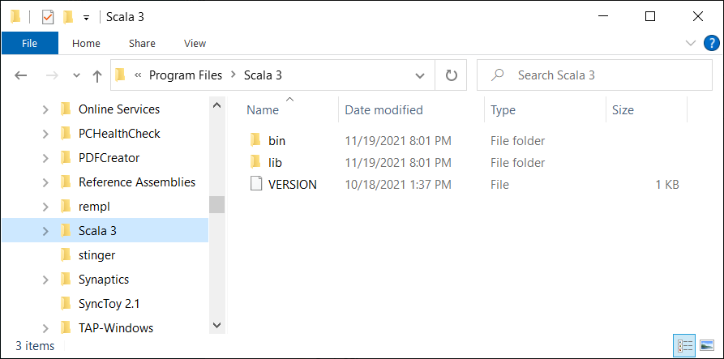
  </a>
  
<b>Figure 1.1 -</b> <i>Scala 3</i> directory (<i>Program Files</i> folder). &nbsp;
  

  

  <a href="images/Scala3First_Menu.png">
  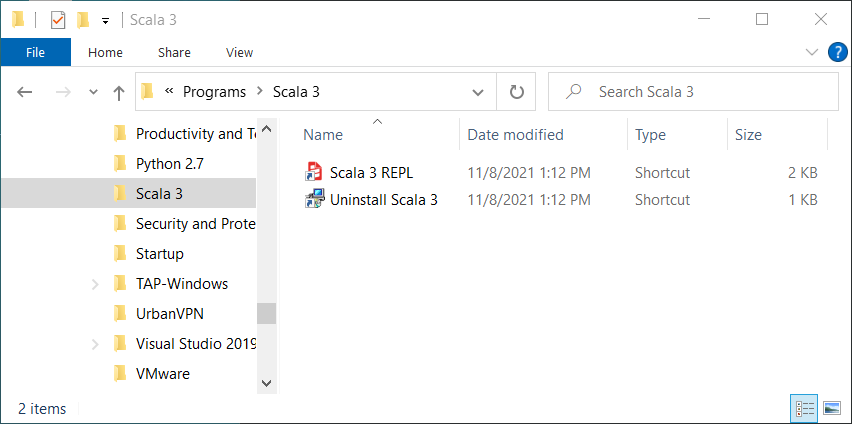
  </a>
  
<b>Figure 1.2 -</b> <i>Scala 3</i> shortcuts (<i>Start Menu</i> folder).
  

</td>
<td style="text-align:center;background-color:#bbeedd;">
  

  <a href="images/Scala3First_StartMenu.png">
  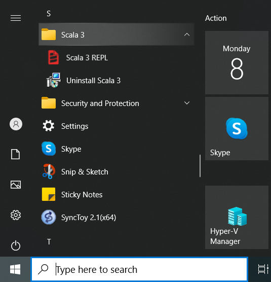
  </a>
  
<b>Figure 1.3 -</b> <i>Scala 3</i> shorcuts (<i>Start Menu</i> folder). &nbsp;
  

  

  <a href="images/Scala3First_REPL.png">
  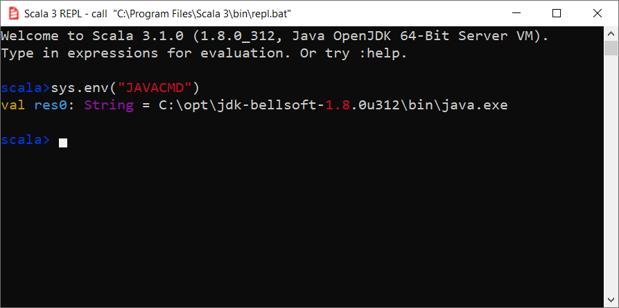
  </a>
  
<b>Figure 1.4 -</b> <i>Scala 3</i> REPL.
  

</td>
<td style="text-align:center;">
  <a href="images/Scala3First_Uninstall.png">
  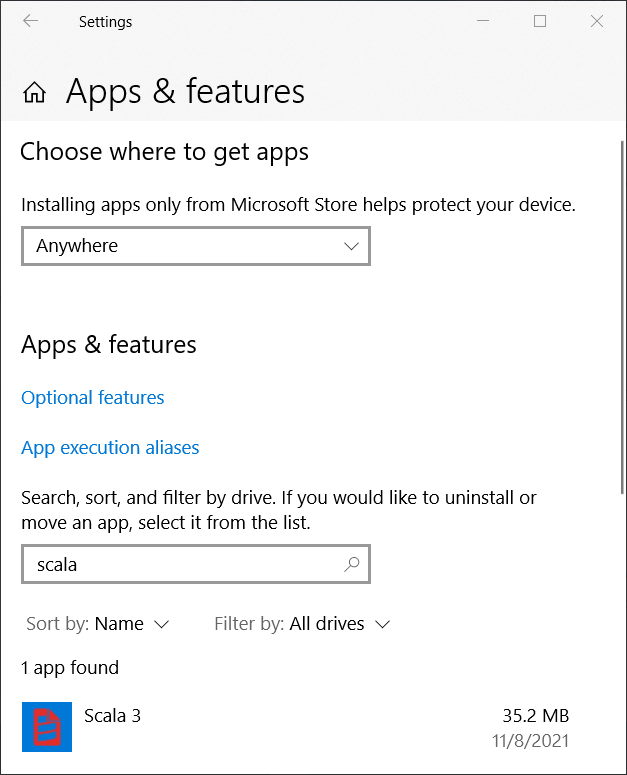
  </a>
  
<b>Figure 1.5 -</b> Uninstall <i>Scala 3</i> (<i>Settings</i> window).
</td>
</tr>
</table>

## Scala3UI

Project `Scala3UI` [2](#footnote_02) adds customizations to the graphical user interface of the [Scala 3][scala3] Windows installer.

The project directory is organized as follows :
<pre style="font-size:80%;">
<b>&gt; <a href="https://docs.microsoft.com/en-us/windows-server/administration/windows-commands/cd">cd</a></b>
Y:\examples\Scala3UI
&nbsp;
<b>&gt; <a href="https://docs.microsoft.com/en-us/windows-server/administration/windows-commands/tree">tree</a> /f . | <a href="https://docs.microsoft.com/en-us/windows-server/administration/windows-commands/findstr">findstr</a> /v /b [a-z]</b>
│   <a href="./Scala3UI/build.bat">build.bat</a>
├───<b>app</b>
│   └───<i>files extracted from</i> <a href="https://github.com/lampepfl/dotty/releases/tag/3.1.0"><b>scala3-3.1.0.zip</b></a>
└───<b>src</b>
    │   <a href="./Scala3UI/src/Includes.wxi">Includes.wxi</a>
    │   <a href="./Scala3UI/src/Scala3UI.wxs">Scala3UI.wxs</a>
    └───<b>resources</b>
            <a href="./Scala3UI/src/resources/BannerTop.bmp">BannerTop.bmp</a>
            <a href="./Scala3UI/src/resources/Dialog.bmp">Dialog.bmp</a>
            <a href="./Scala3UI/src/resources/logo.svg">logo.svg</a>
            favicon.ico
            LICENSE.rtf
            network.ico
            <a href="./Scala3UI/src/resources/repl.bat">repl.bat</a>
</pre>

Figures **2.1** to **2.4** below illustrate the dialog windows of the Windows installer while figures **2.5** and **2.6** show the updated user environment after the successful execution of the [Scala 3][scala3] Windows installer.

<table>
<tr>
<td style="text-align:center;background-color:#bbeedd;">
  

  <a href="images/Scala3UI_Setup1.png">
  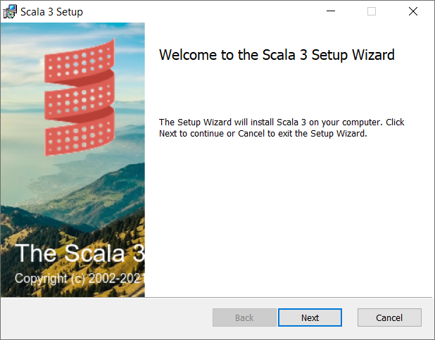
  </a>
  
<b>Figure 2.1 -</b> Welcome (<i>Scala 3</i> installer). &nbsp;
  

  

  <a href="images/Scala3UI_Setup2.png">
  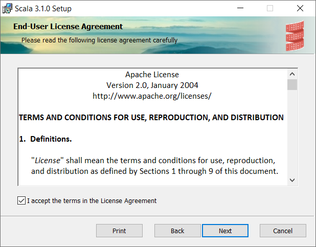
  </a>
  
<b>Figure 2.2 -</b> EULA (<i>Scala 3</i> installer).
  

</td>
<td style="text-align:center;background-color:#bbeedd;">
  

  <a href="images/Scala3UI_Setup3.png">
  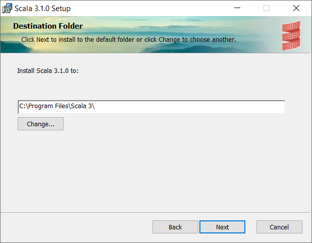
  </a>
  
<b>Figure 2.3 -</b> Destination folder (<i>Scala 3</i> installer). &nbsp;
  

  

  <a href="images/Scala3UI_Setup5.png">
  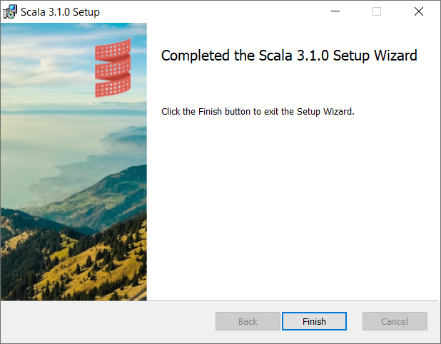
  </a>
  
<b>Figure 2.4 -</b> Completed installation (<i>Scala 3</i> installer).
  

</td>
<td style="text-align:center;">
  

  <a href="images/Scala3UI.png">
  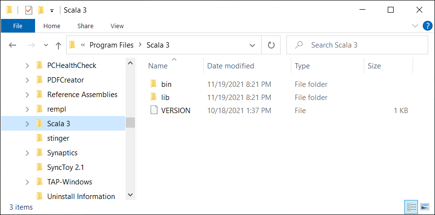
  </a>
  
<b>Figure 2.5 -</b> <i>Scala 3</i> directory (<i>Program Files</i> folder). &nbsp;
  

  

  <a href="images/Scala3UI_Menu.png">
  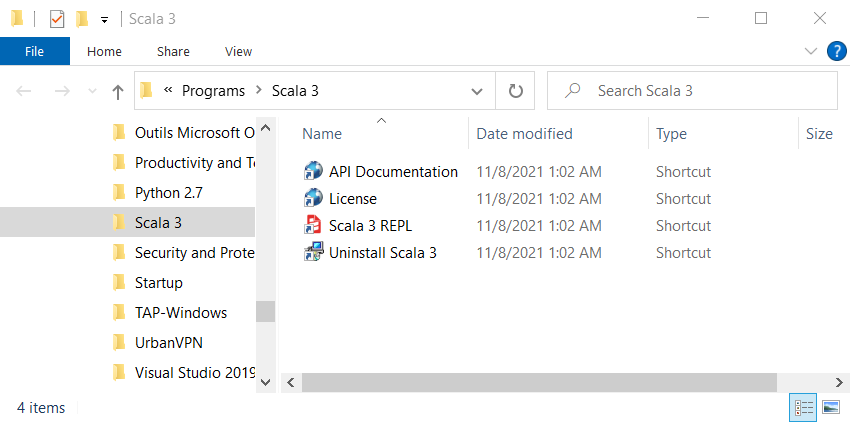
  </a>
  
<b>Figure 2.6 -</b> <i>Scala 3</i> shortcuts (<i>Start Menu</i> folder).
  

</td>
</tr>
</table>

## Scala3Localized

Project `Scala3Localized` [2](#footnote_02) adds language localization to the [WiX][wix_toolset] source files of the [Scala 3][scala3] Windows installer.

This project contains the additional directory [`src\localizations\`](./Scala3Localized/src/localizations/) with 4 [WiX localization files](https://wixtoolset.org//documentation/manual/v3/wixui/wixui_localization.html):
<pre style="font-size:80%;">
<b>&gt; <a href="https://docs.microsoft.com/en-us/windows-server/administration/windows-commands/cd">cd</a></b>
Y:\examples\Scala3Localized
&nbsp;
<b>&gt; <a href="https://docs.microsoft.com/en-us/windows-server/administration/windows-commands/tree">tree</a> /f . | <a href="https://docs.microsoft.com/en-us/windows-server/administration/windows-commands/findstr">findstr</a> /v /b [a-z]</b>
│   <a href="./Scala3Localized/build.bat">build.bat</a>
├───<b>app</b>
│   └───<i>files extracted from</i> <a href="https://github.com/lampepfl/dotty/releases/tag/3.1.0"><b>scala3-3.1.0.zip</b></a>
└───<b>src</b>
    │   <a href="./Scala3Localized/src/Includes.wxi">Includes.wxi</a>
    │   <a href="./Scala3Localized/src/Scala3Localized.wxs">Scala3Localized.wxs</a>
    ├───<b>localizations</b>
    │       <a href="./Scala3Localized/src/localizations/de-DE.wxl">de-DE.wxl</a>
    │       <a href="./Scala3Localized/src/localizations/en-US.wxl">en-US.wxl</a>
    │       <a href="./Scala3Localized/src/localizations/fr-FR.wxl">fr-Fr.wxl</a>
    │       <a href="./Scala3Localized/src/localizations/sv-SE.wxl">sv-SE.wxl</a>
    └───<b>resources</b>
            <a href="./Scala3Localized/src/resources/BannerTop.bmp">BannerTop.bmp</a>
            <a href="./Scala3Localized/src/resources/Dialog.bmp">Dialog.bmp</a>
            <a href="./Scala3Localized/src/resources/logo.svg">logo.svg</a>
            favicon.ico
            LICENSE.rtf
            network.ico
            <a href="./Scala3Localized/src/resources/repl.bat">repl.bat</a>
</pre>

Command [`build link`](./Scala3Localized/build.bat) generates a separate MSI file for each language localization, e.g. `scala3-3.1.0-sv-SE.msi` is the swedish version of the [Scala 3][scala3] Windows installer.

<pre style="font-size:80%;">
<b>&gt; <a href="./Scala3Localized/build.bat">build</a> clean link && <a href="https://docs.microsoft.com/en-us/windows-server/administration/windows-commands/dir">dir</a> /b /a-d target</b>
candle_opts.txt
candle_sources.txt
Fragments.wixobj
light_opts.txt
replace.ps1
<b>scala3-3.1.0.msi</b>
scala3-3.1.0.msi.md5
scala3-3.1.0.msi.sha256
scala3-3.1.0.wixpdb
<b>scala3-3.1.0_de-DE.msi</b>
scala3-3.1.0_de-DE.msi.md5
scala3-3.1.0_de-DE.msi.sha256
scala3-3.1.0_de-DE.wixpdb
<b>scala3-3.1.0_fr-FR.msi</b>
scala3-3.1.0_fr-FR.msi.md5
scala3-3.1.0_fr-FR.msi.sha256
scala3-3.1.0_fr-FR.wixpdb
<b>scala3-3.1.0_sv-SE.msi</b>
scala3-3.1.0_sv-SE.msi.md5
scala3-3.1.0_sv-SE.msi.sha256
scala3-3.1.0_sv-SE.wixpdb
Scala3Localized.wixobj
</pre>

Figures **3.1** to **3.4** below illustrate the "**Welcome**" dialog window of the [Scala 3][scala3] Windows installer in english, german, french and swedish.

<table>
<tr>
<td style="text-align:center;">
  

  
  
<b>Figure 3.1 -</b> Welcome (<i>english</i> version). &nbsp;
  

  

  <a href="images/Scala3Localized_Setup1_de.png">
  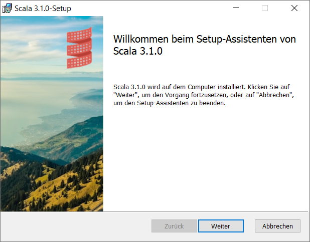
  </a>
  
<b>Figure 3.2 -</b> Willkommen (<i>german</i> version).
  

</td>
<td style="text-align:center;">
  

  <a href="images/Scala3Localized_Setup1_fr.png">
  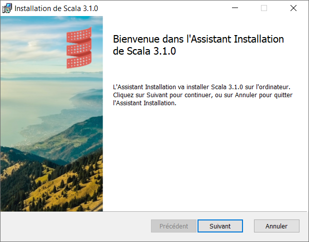
  </a>
  
<b>Figure 3.3 -</b> Bienvenue (<i>french</i> version). &nbsp;
  

  

  <a href="images/Scala3Localized_Setup1_sv.png">
  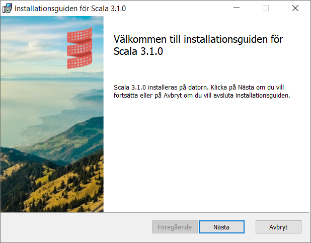
  </a>
  
<b>Figure 3.4 -</b> Välkommen (<i>swedish</i> version).
  

</td>
</tr>
</table>

## Scala3Features

Project `Scala3Features` [2](#footnote_02) adds feature customization to the [Scala 3][scala3] Windows installer.

*wip*

## Footnotes

<b name="footnote_01">[1]</b> **`Fragments.wxs`** [↩](#anchor_01)

We not just call the <a href="https://wixtoolset.org/documentation/manual/v3/overview/heat.html"><code>heat</code></a> tool to generate the file <code>target\src_gen\Fragments.wxs</code> in the above projects, we also specify the option <code>-t <a href="./Scala3UI/src/resources/Fragments.xslt">src\resources\Fragments.xslt</a></code> to apply a few XML transformations to the generated <a href="https://wixtoolset.org/">WiX</a> source file (eg. addition of component element <code>"repl.bat"</code>).

<b name="footnote_02">[2]</b> ***Environment variables*** [↩](#anchor_02)

Unlike the first project <code>Scala3First</code> the following projects <code>Scala3UI</code>, <code>Scala3Localized</code> and <code>Scala3Features</code> generate a <a href="https://dotty.epfl.ch/">Scala 3</a> Windows installer which will <i>update</i> the system environment as follows :

<pre style="margin:0 0 1em 20px;font-size:80%;">
<b>&gt; <a href="https://docs.microsoft.com/en-us/windows-server/administration/windows-commands/set_1">set</a> | <a href="https://docs.microsoft.com/en-us/windows-server/administration/windows-commands/findstr">findstr</a> SCALA</b>
SCALA3_HOME=C:\Program Files\Scala 3\
&nbsp;
<b>&gt; <a href="https://docs.microsoft.com/en-us/windows-server/administration/windows-commands/where">where</a> scala</b>
C:\Program Files\Scala 3\bin\scala
C:\Program Files\Scala 3\bin\scala.bat
</pre>

<b name="footnote_03">[3]</b> ***Default Java Location*** [↩](#anchor_03)

OpenJDK implementations are available either as Zip files (<code>.zip</code/>) or as Windows installers (<code>.msi</code>).

Unfortunately each Windows installer suggests a <i>different</i> default installation location <b>and</b> follows <i>inconsistent</i> naming conventions:

<table style="margin:0 0 1em 20px;font-size:80%;">
<tr>
  <th style="padding:6px;">OpenJDK Implementation</th>
  <th style="padding:6px;">Default location in directory <code>%ProgramFiles%</code></th>
</tr>
<tr>
  <td style="padding:6px;"><a href="https://github.com/corretto/corretto-11/releases">Amazon Corretto 11</a></td>
  <td style="padding:6px;"><code>Amazon Corretto\jdk11.0.13_8\</code></td>
</tr>
<tr>
  <td style="padding:6px;"><a href="https://www.azul.com/downloads/?version=java-8-lts&package=jdk">Azul Zulu 8</a></td>
  <td style="padding:6px;"><code>Zulu\zulu-8\</code></td>
</tr>
<tr>
  <td style="padding:6px;"><a href="https://www.azul.com/downloads/?version=java-11-lts&package=jdk">Azul Zulu 11</a></td>
  <td style="padding:6px;"><code>Zulu\zulu-11\</code></td>
</tr>
<tr>
  <td style="padding:6px;"><a href="https://adoptium.net/?variant=openjdk8&jvmVariant=hotspot">Eclipse&nbsp;Temurin&nbsp;8</a></td>
  <td style="padding:6px;"><code>Eclipse Adoptium\jdk-8.0.312.7-hotspot\</code></td>
</tr>
<tr>
  <td style="padding:6px;"><a href="https://adoptium.net/?variant=openjdk11&jvmVariant=hotspot">Eclipse&nbsp;Temurin&nbsp;11</a></td>
  <td style="padding:6px;"><code>Eclipse Adoptium\jdk-11.0.13.8-hotspot\</code></td>
</tr>
<tr>
  <td style="padding:6px;"><a href="https://adoptium.net/?variant=openjdk17&jvmVariant=hotspot">Eclipse&nbsp;Temurin&nbsp;17</a></td>
  <td style="padding:6px;"><code>Eclipse Adoptium\jdk-17.0.1.12-hotspot\</code></td>
</tr>
<tr>
  <td style="padding:6px;"><a href="https://docs.microsoft.com/en-us/java/openjdk/download#openjdk-11">Microsoft 11</a></td>
  <td style="padding:6px;"><code>Microsoft\jdk-11.0.13.8-hotspot\</code></td>
</tr>
<tr>
  <td style="padding:6px;"><a href="https://developers.redhat.com/products/openjdk/download">RedHat 8</a></td>
  <td style="padding:6px;"><code>RedHat\java-1.8.0-openjdk-1.8.0.312.2\</code></td>
</tr>
<tr>
  <td style="padding:6px;"><a href="https://developers.redhat.com/products/openjdk/download">RedHat 11</a></td>
  <td style="padding:6px;"><code>RedHat\java-11-openjdk-11.0.13-1\</code></td>
</tr>
<tr>
  <td style="padding:6px;"><a href="https://sap.github.io/SapMachine/">SapMachine 11</a></td>
  <td style="padding:6px;"><code>SapMachine\JDK\11\</code></td>
</tr>
</table>

<b name="footnote_04">[4]</b> ***Batch file* `build.bat`** [↩](#anchor_04)

Command <a href="./Scala3First/build.bat"><code>build help</code></a> displays the batch file options and subcommands :

<pre style="margin:0 0 1em 20px;font-size:80%;">
<b>&gt; <a href="./Scala3First/build.bat">build</a> help</b>
Usage: build { &lt;option&gt; | &lt;subcommand&gt; }
&nbsp;
  Options:
    -debug       show commands executed by this script
    -timer       display total execution time
    -verbose     display progress messages
&nbsp;
  Subcommands:
    clean        delete generated files
    help         display this help message
    install      execute Windows installer scala3
    link         create Windows installer from WXS/WXI/WXL files
    remove       remove installed program (same as uninstall)
    uninstall    remove installed program
</pre>

***

*[mics](https://lampwww.epfl.ch/~michelou/)/November 2021* [**&#9650;**](#top)
&nbsp;

<!-- link refs -->

[firegiant]: https://www.firegiant.com/
[microsoft_powershell]: https://docs.microsoft.com/en-us/powershell/scripting/getting-started/getting-started-with-windows-powershell?view=powershell-6
[scala3]: https://dotty.epfl.ch
[scala3_releases]: https://github.com/lampepfl/dotty/releases
[windows_program_files]: https://en.wikipedia.org/wiki/Program_Files
[windows_settings]: https://support.microsoft.com/en-us/windows/find-settings-in-windows-10-6ffbef87-e633-45ac-a1e8-b7a834578ac6
[windows_start_menu]: https://support.microsoft.com/en-us/windows/see-what-s-on-the-start-menu-a8ccb400-ad49-962b-d2b1-93f453785a13
[wix_candle]: https://wixtoolset.org/documentation/manual/v3/overview/candle.html
[wix_component]: https://wixtoolset.org/documentation/manual/v3/xsd/wix/component.html
[wix_heat]: https://wixtoolset.org/documentation/manual/v3/overview/heat.html
[wix_light]: https://wixtoolset.org/documentation/manual/v3/overview/light.html
[wix_toolset]: https://wixtoolset.org/
